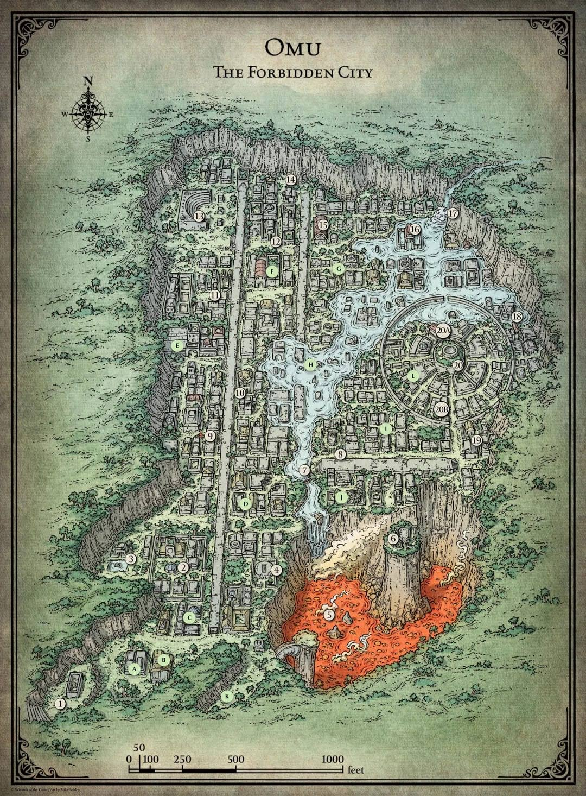

# Campagna

## OMU

stanza delle guardie
 collassata piena di rampicanti, ha dei graffiti scritti in comune:

1. "fear the fangs of rans si"
2. "Erik i've gone in search of the nine shines. -V"
3. "puzzle cubes are the key"  
4. "beware of the frog monster"  
5. "who is Unkh?"  
6. "all hale the king of fethers"
7. "the snake are not what they seem"
8. "Kubazan=Bravery. Shagambi=Wisdom. Moa=?"

### zona 2

Ci avviciniamo in una zona con un fuoco appicato su dei cadaveri, umani e non. i più "freschi" sono stati uccisi con delle armi da taglio, quelli più vecchi sono troppo difficili da identificare perchè bruciati,
in un muro vicino la pila di cadaveri si nota un simbolo di un serpente a spirale che tiene in bocca un cerchio,
rappresenta Dendar the night serpent devouring the world.  
Sentiamo delle grida di aiuto da qualcuno, è qualcuno rimasto bloccato tra le macerie; lo tiriamo fuori.  
Dice di chiamarsi __Orbex__, dice che tutto il opsrto è andato distrutto per via di persone strane, alcuni serpentiformi.  
Faceva parte di una spedizione, si trovava ad OMU (città abbandonata da diversi anni) per i "red wizards" (di fatti nelle vicinanze si notano molti cadaveri con mantelli rossi).  
Potrebbe essere utile portarlo con noi come guida perchè sà leggere le antiche lingue parlate (e scritte) nella città.  
Lo porteremo con noi, ci parla di una antica leggenda.  

    Molto tempo fa, il dio Ubtao indurì il suo cuore e giurò di non piangere più per il popolo di Omu. Le piogge cessarono, la giungla appassì e morì, e la morte spazzò via Omu.  
    Una mattina, un saggio zorbo emerse dal suo albero cavo e parlò agli Omuani morenti. Per convincere Ubtao del loro valore, decise di cucinargli uno stufato fatto con tutte le loro buone qualità. Catturare tali virtù non sarebbe facile, quindi ha chiesto a un malizioso almiraj di aiutarla. Il almiraj infilzò la temerarietà nella pentola, che considerava una virtù, e Ubtao sputò lo stufato quando lo assaggiò. Da quel giorno, Obo'laka lo zorbo e I'jin the almiraj divennero terribili nemici.

    A mezzogiorno, un coraggioso kamadan saltò giù dalla sua roccia. Vide il male nei cuori degli Omuani e decise di lanciarlo come un fastidioso punto di ebollizione. La kamadan ha modellato una lancia sacra, ma l'ha lasciata sulla riva del fiume e un furbo l'ha rubata. Nella sua rabbia, Shagambi il Kamadan dimenticò tutto degli Omuani e inseguì Nangnang il grung per sempre attraverso il cielo.

    Quando arrivò la sera, un astuto eblis uscì dalla sua capanna di canna. Gli Omuani non gli piacevano, ma senza di loro non avrebbe nessuno su cui giocare. Gli eblis mandarono una rana palustre a ragionare con Ubtao, ma la rana era arrabbiata e decise invece di lottare contro il dio. Questo Ubtao divertito, così ha dato i tentacoli alla rana per renderlo più forte. Quando Kubazan il froghemoth tornò a Papazotl gli eblis, inseguì Papazotl nella palude con i nuovi tentacoli.

    Quella notte, un su-mostro fece irruzione nel palazzo di Ubtao e rubò un secchio d'acqua per gli Omuani. Quando il dio venne a correre per trovarlo, il su-mostro nascose il secchio nella tana di un jaculi. Ubtao chiese agli animali della giungla dove era nascosta la sua acqua, e Moa il jaculi era troppo onesto per mentire. Quando Wongo il su-mostro scoprì come Moa lo aveva tradito, giurò di catturare il jaculi e mangiarlo.

    Per tutto il tempo, Unkh la lumaca di flagello visse in profondità sotto la terra. Il rumore degli altri animali che la combattevano la fece scivolare in superficie e quando il giorno spuntò dal suo guscio, la luce accecò Ubtao e gli fece lacrimare gli occhi. La vita tornò a Omu e la gente costruì santuari per onorare gli animali che li avevano salvati.

_in inglese_:

    Long ago, the god Ubtao hardened his heart and vowed to weep for the people of Omu no longer. The rains stopped, the jungle withered and died, and death swept through Omu.

    One morning, a wise zorbo emerged from her hollow tree and spoke to the dying Omuans. To convince Ubtao of their worth, she decided to cook him a stew made from all their good qualities. Catching such virtues wouldn’t be easy, so she asked a wily almiraj to help her. The almiraj.snuck recklessness in the pot, which she saw as a virtue, and Ubtao spat out the stew when he tasted it. From that day on, Obo’laka the zorbo and I'jin the almiraj became terrible enemies.

    At noon, a brave kamadan hopped down from her rock. She saw the evil in the Omuan’s hearts and decided to lance it like a troublesome boil. The kamadan fashioned a holy spear, but she left it by the riverbank and a crafty grung stole it. In her rage, Shagambi the kamadan forgot all about the Omuans and chased Nang-Nang the grung forever across the sky.

    When evening came, a wily eblis stepped from his reed hut. He didn’t like the Omuans, but without them he’d have no one to play his tricks on. The eblis sent a marsh frog to reason with Ubtao, but the frog was angry and decided to wrestle the god instead. This amused Ubtao, so he gave the frog tentacles to make it stronger. When Kubazan the froghemoth returned to Papazotl the eblis, he chased Papazotl into the swamp with his new tentacles.

    That night, a su-monster broke into Ubtao’s palace and stole a pail of water for the Omuans. When the god came running to find it, the su-monster hid the pail in a jaculi’s burrow. Ubtao asked the jungle animals where his water was hidden, and Moa the jaculi was to honest to lie. When Wongo the su-monster found out how Moa had betrayed him, he vowed to catch the jaculi and eat him up.

    All the while, Unkh the flail snail lived deep under the earth. The noise of the other animals fighting made her slither up to the surface, and when day dawned over her shell, the light blinded Ubtao and made his eyes water. Life returned to Omu, and the people built shrines honor the the animals who’d saved them.

Il __-V__ che ha scritto il messaggio nel bagno è un tizio di una spedizione collegata a quella di Orbex, Erik purtroppo è morto.

Anche il nome Moa era presente nei graffiti del bagno, probabilmente il punto interrogativo sarà qualcosa di collegato a "Moa the jaculi was to honest to lie"  Moa=Honesty?  

Anche Unkh è nella storia.

Cambiamo zona

### zona 3

Notiamo una piscina rettangolare piena di acqua melmosa, dovebbe essere un tempio, al centro c'è un pilastro con un volto simile a quello di una rana.

Ci avviciniamo al tempio, la porta è chiusa a chiave, c'è una scritta:

    kubazan urges us to tread without fear and to give back as much as we take 

Dalla piscina esce fuori un Froghemoth
Sconfitta ci avviciniamo alla statua della rana dove troviamo una chiave.  
Usiamo la chiave per aprire la porta del cancello.

Troviamo delle spine uscire dal pavimento, al nostro opposto vediamo un dipinto di un Froghemoth Kubazan che combatte con Papazotl the eblis

Massimo ha provato il suicidio ed è caduto sulle spine  

Riesce a risalire e arriva all'altare, dove trova un cubo (la chiave descritta nei murales?), lo prende e si chiudono le porte e comincia ad uscire del gas

Facendo parkour lo riporta indietro, in questo cubo sembra esserci raffigurata una rana (probabilmente esiste un cubo per ognuno degli dei)

__Sabato 08/10/2022__.

### zona 4

Ci dirigiamo verso il punto 4 della mappa, ci ritroviamo di fronte quello che credimo un tempio, protetto da due specie di chimere.

Analizzando la porta si trivani deu rilievi in _old nomuan_ che il vecchio sa leggere

    teaches us to fight evil with honor

Ci sono anche dei disegni di Shagambi osseva i chultani che si allenano con spade e lance.

Spingendo tutti insieme riusciamo ad aprire la porta

Scendiamo le scale d'ingrsso, ci troviamo (dove sono le stelle) 4 statue di Omuani (abitanti di ohu), le grate sotto coprono una "fossa dei gladiatori".
Oltre la fossa si vede un piedistallo vuoto.
Dietro si nota un disegno di un leopardo che combatte con una rana tozza (shagambi che combatte con Nang nang)

Massimo ritenta il suicidio e si butta nella fossa dei gladiatori.

Lo seguiamo scendendo dalle scale, delle statue di terracotta raffiguranti gladiatori romuani ci attaccano.

Riusciamo a sconfiggerli con molta difficoltà.  
Le loro lance di metallo sono rimaste a terra

_Sabato 15/10/2022_.

Prendiamo le lancie e le portiamo al piano superiore, le mettiamo in mano alle statue che avevano un buco nelle mani preciso per le lance.

Una volta inserite tutte le lancie dal piedistallo esce fuori un cubo come quello ritrovato nel tempio precedente.

### zona 5

Ci avviciniamo al picco che punta verso il punto 5 della mappa, al ponticello si nota un gruppo di mostri.

Sembrano essere dei vegepigmi (simili agli zulugorgi ma più grandi Tra di loro c'è un grung, legato con delle corde, sembra stia per essere sacrificato dai vegepigmi.

Massimo prova ad interagire con gli esserini, finirà male come al solito.

Massimo decide di ballare con loro.

Uno dei vegepigmi più grossi butta il grung nella lava, altri due lo seguono.

Ballando, gli animaletti e Massimo si avvicinano verso il bordo, Massimo però salta via per evitare di finire come gli altri caduti di sotto.

Ci attacano.  

Una volta sconfitti cerchiamo un modo per scendere ma non sembra esserci.

Visro che non ci è possibile andare verso il punto 6, ci dirigiamo verso il punto 7

### zona 7

Ci ritroviamo un di fronte ad un ponte improvvisato con un tronco d'acqua.  
Si nota abbastanza bene che una parte della città è stata sommersa da questo fiume, che si siano rotti gli argini del fiume con il passare del tempo?

Massimo prova ad attraversare il ponte, ma viene subito colpito da una freccia

Ci attacca quello che sembra essere un ladro, a metà del fight tenta di fuggire. Mentre gli altri lo inseguono io distruggo il ponte da cui siamo entrati, per evitare che il tizio scappi da dietro.  

__Venerdì 21/10/2022__:

Dopo esserci riposati ci dirigiamo verso il punto 8

### zona 8

Arrivati passando per la lunga strada di cemento arriviamo al tempio  

All'entrata ci sono due colonne, in cima ad entrambe è presente una statua di una lumaca.

Andiamo nella piccola struttura sulla sinistra, sembra essere un vecchio ripostiglio abbandonato.

La porta non c'è piuù, il tetto è crollato e sembra essere tutto rovinato. Notiamo però un centinaio di chiavi di ferro appese alle pareti, alcune vecchie, alcune rotte o arrugginite; comunque alcune sembrano poter essere ancora utilizzabili.

Ci avviciniamo alla struttura principale,

c'è una scritta sopra la porta

    Unkh urges us to contrast all options before acting

Spingendo tutti insieme riusciamo ad aprire la porta.

All'interno vediamo:

  

Appena entrati vediamo una statua con dientro un piedistallo piedistallo (come quello del tempio precedente). Nel nuro sono presenti delle insenature, ognuna con una chiave di ferro come quelle trovate prima.  

La statua raffigura una lumaca come quella della storia con Unkh  

Da dietro la statua escono fuori 3 ghast con la forma di chultiani (ex abitanti di Chult).

Dopo averli sconfitti notiamo che sul piedistallo c'è una serratura, troviamo la chiave corretta e recuperiamo anche il cubo di  Unkh  

Massimo si avvicina al punto 6 per vedere se c'era qualche cosa che ci potesse far attraversare il lago di lava.  

### zona 6

Facendo una fionda con un albero (molto improvvisata) Massimo riesce a "volare" sino quel punto.  

Questo è quello che vede massimo:  

Il tempio non ha porte, sull'uscio dell'entrata escono fuori 4 serpenti grandi che attaccano Massimo

Massimo scappa entrando nel tempio.
Trovi un corridoio che porta a 3 stanze  

Con lo stealth, nella stanza a destra trova molte ragnatele una statua con un cubo (come quelli che abbiamo già recuperato) nelle sue fauci

Nella stanza a sinistra trova la stessa situazione, tranne per la statua che invece è distrutta e il cubo si trova per terra.

Nella stanza centrale sono presenti diverse balestre che puntano tutte al centro della stanza, dove è presente un mosaico ricorperto di muschio, inoltre è presente anche un piedistallo con ancora un cubo sopra.

Nel mosaico è rappresentato un serpente aggrovigliato su di una scimmia, in alto all'immagine vede una scritta, però non è in grado di comprenderla.  

Massimo si avvicina all'altare e con la spada spinge il cubo giù dal piedistallo lasciandolo cadere, le statue e le balestre si animano e lo attaccano.

Massimo rimane stabile ma morente in mezzo alla stanza.

Giacomo si è accorto di avere della corda, unita a quella di Emanuele siamo riusciti a fare una corda abbastanza lunga per poter attraversare il lago.

Arriviamo all'entrata del tempio e combattiamo con i serpenti.  
Li sconfiggiamo ed entriamo dentro.  
Arriviamo nella stanza in cui Massimo è stato ammazzato, le scritte sul mosaico dicono:

    Moa teaches us that secrets hide the truth  

    Death rewards a thief deceived. Truth comes from the serpents mouth  

Giacomo vuole provare a prendere il cubo da per terra e correre via, lo aiuto curandolo e dandogli + classe armatura

Riesce ad uscire fuori ma il cubo si dissolve alla luce del sole.

Dopo diversi tentativi, notiamo che nella stanza con le balestre c'erano delle porte nascoste che portavano alle altre stanze. Prendiamo il cubo della stanza a destra partendo dall'entata.

Usciamo dal tempio.

__Friday 28/10/2022__:

Ce ne andiamo dall' "isola" come nello stesso modo con cui ci siamo arrivati, con le corde.  

### zona 9

Andando verso la zona 9 passiamo per il punto 7, dove ho rotto il ponte, quindi tocca usare l'incantesimo per attraversare l'acqua.  

Arrivati troviamo un campo abbandonato con delle tende distrutte e dell'attrezzatura da campeggio abbastanza arrugginita.  
Al centro del campo si vede un palo con una bandiera gialla improvvisata con uno straccio rovinato  

In una delle tende Massimo trova una pergamena arrotolata:

    Rue,
    Devlin has a lead on the Eye of Zaltec! The old goat found an obelisk to the north that masks the entrance to the Tomb of the Nine Gods. The Eye must be within, but the door is magically locked. We think the secret to opening it lies in the holy shrines.
    We've headed into the ruins to check them out: Gods willing, we'll be back tonight. Ras Nsi's serpent people are on the prowl, so be careful. If you get into trouble, sound the swan horn twice and we'll come running.
    For the Yellow Banners,
    Lord Brixton

Rubo la bandiera, nel mentre Giacomo decide di urlare (ha meno 1 a intelligenza)  

Grazie all'urlo, 3 uomini ci raggiungono, tra cui 2 avventurieri e un anziano con un cappuccio rosso, come quello dei compagni di Orbex.  

Massimo muore in combattimento, io ci vado molto vicino.  

__Friday 05/11/2022__:

Ci riposiamo, piangiamo la morte di Massimo (lol) e decidiamo di continuare verso il punto 10.

Prima di incamminarci sento qualcuno rovistare dietro di me, è un piccolo goblin che rovista nei cadaveri dei combattenti della scorsa volta.

Il goblin (Massimo) vuole unirsi a noi, però siccome non ci convince e per questo ci avviamo al punto 10 senza di lui.

Il goblin ci segue di nascosto.

### zona 10

Arrivati al tempio, entriamo nel cortile recintato, troviamo un'incisione di un coniglio cornuto che sta caricando un simil orso (piccolo) con degli artigli affilati.  
Oltre all'incisione c'è un messaggio che viene tradotto in

    I'jin teaches us to take the path least expected.

Entriamo dalla porta principale, per terra troviamo delle incisioni

Oltre al pavimento con le iscrizioni c'è altro pavimento e poi un muro

Risolviamo l'enigma passando nella colonna tutta a sinistra.
Oltre questo corridoio troviamo un bivio, ci separiamo e ci ritroviamo in un labirinto.

Massimo riesce a trovare il cubo e incontrandomi nella strada per tornare indietro me lo passa, così lo aggiungo agli altri cubi.

Una volta fuori vede all'ingresso un coniglio con un corno (almiraj), torna indietro e si nasconde dietro un muro, dove trovo anche io il coniglio cornuto.

Come ci siamo avvicinati per uscire il coniglio è scappato via.

Decidiamo di continuare ad andare avanti e ci dirigiamo verso il punto 11

### zona 11

Nella strada per arrivare al punto notiamo dei cespugli che si muovono, da lì escono fuori dei goblin, li uccidiamo.

Arriviamo al punto, troviamo un carro ribaltato, con petali di fiori sparsi intorno e nidi d'ape nelle ruote.

Una ghirlanda di fiori è stata appesa sul traino del carro.

Emanuele trova sotto il carro, un disco ricoperto di muschio con scritte in comune e in caratteri cuneiformi

in comune è scritto

    Queen Napaka proclaims the free people of Omu fear nothing. Brave new gods protect us, as Uptao did before but thats no longer. Omu will rise again, and Napaka shall reclaim all that is hers by right of conquest

Con questo disco possiamo tradurre tutte le scritte anche senza l'aiuto del vecchio, che è morto punto da un'ape, evidentemente era allergico e la medicina qui non è andata molto avanti.

Ho pregato Dio e sono riuscito a dar fuoco ai vestiti di Nanni pupu 

Decidiamo di dirigerci verso il punto 12

### zona 12

Mentre ci incamminiamo notiamo che le api ci seguono, notiamo anche un odore di miele.
L'odore proveniva da uno zulugorgi che si è nascosto nei miei pantaloni, mi ha anche dato uno charm

    Charm of Snowball Strike

    This charm has 5 charges. As a bonus action, you can expend 1 of the charm's charges to create a magical snowball in your hand and throw it. You must have a hand free to hold the snowball, or the charge is wasted. The snowball is a magic ranged weapon with which you are proficient. It has a normal range of 20 feet and a long range of 60 feet, it deals 1d4 cold damage on a hit, and it scores a critical hit on a roll of 19 or 20. If you score a critical hit with the snowball, the target is blinded until the end of its next turn. The snowball vanishes immediately after you hit or miss with it, or at the end of your turn if you don't throw it. Once all its charges have been expended, this charm vanishes from you.

Lo chiamerò Gimapiero.