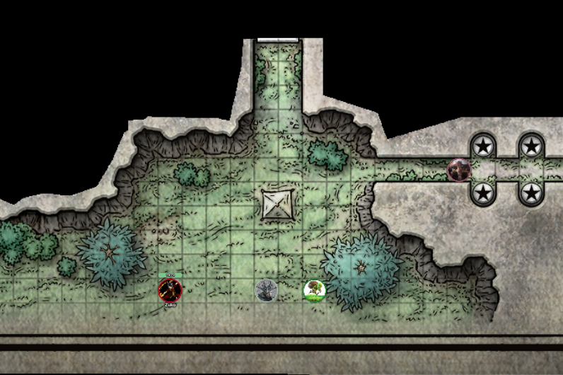
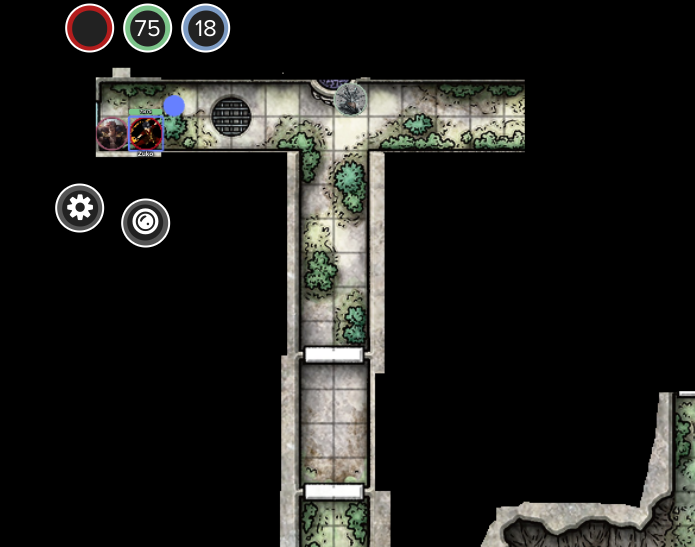
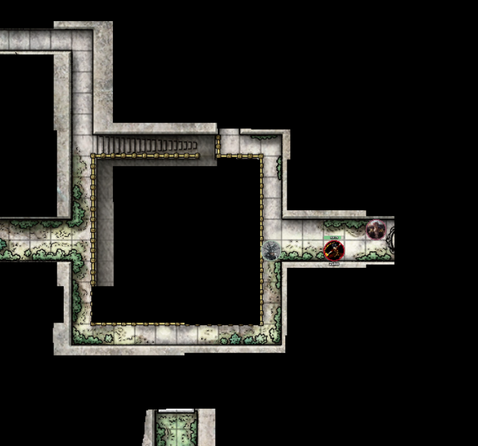
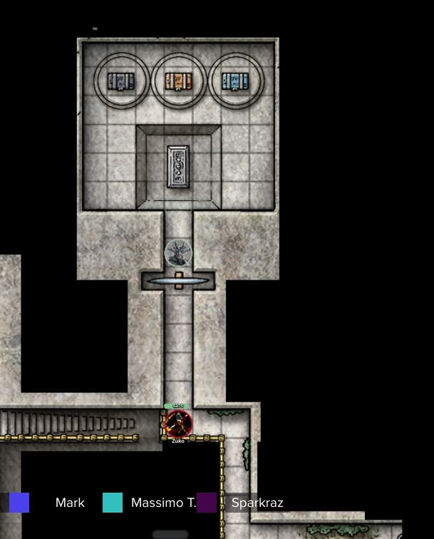
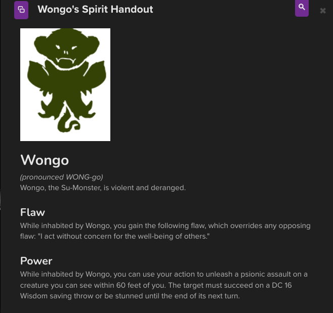
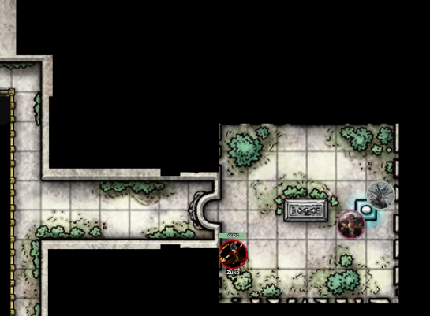
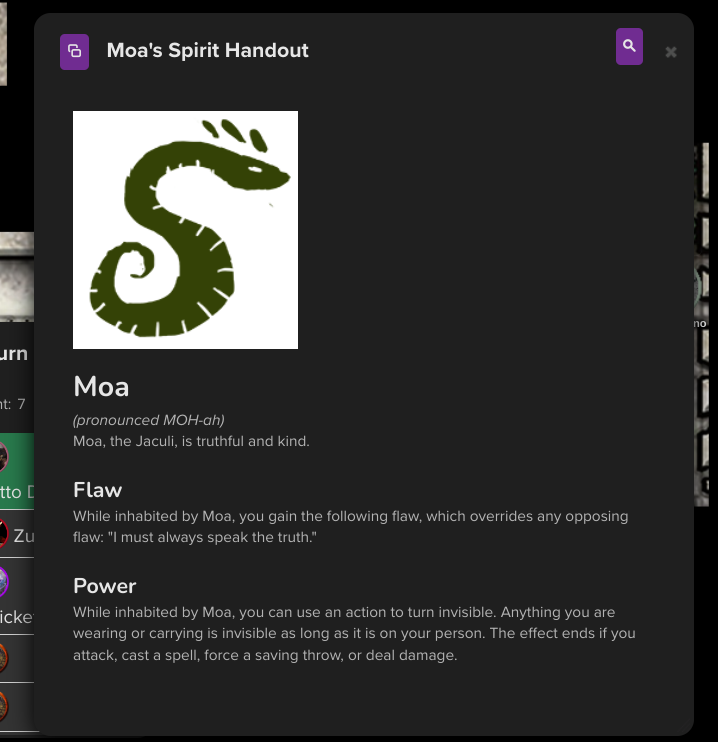
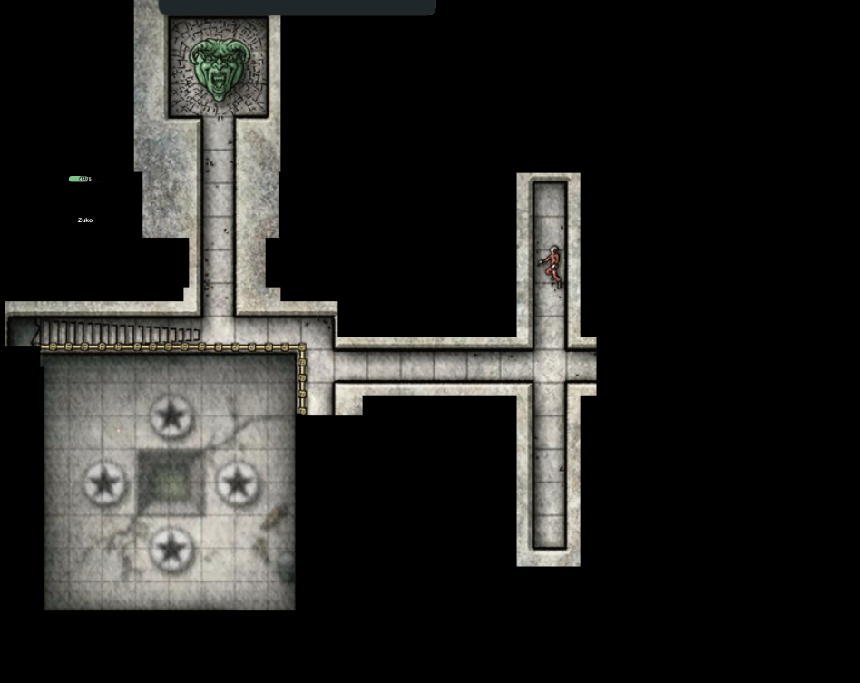
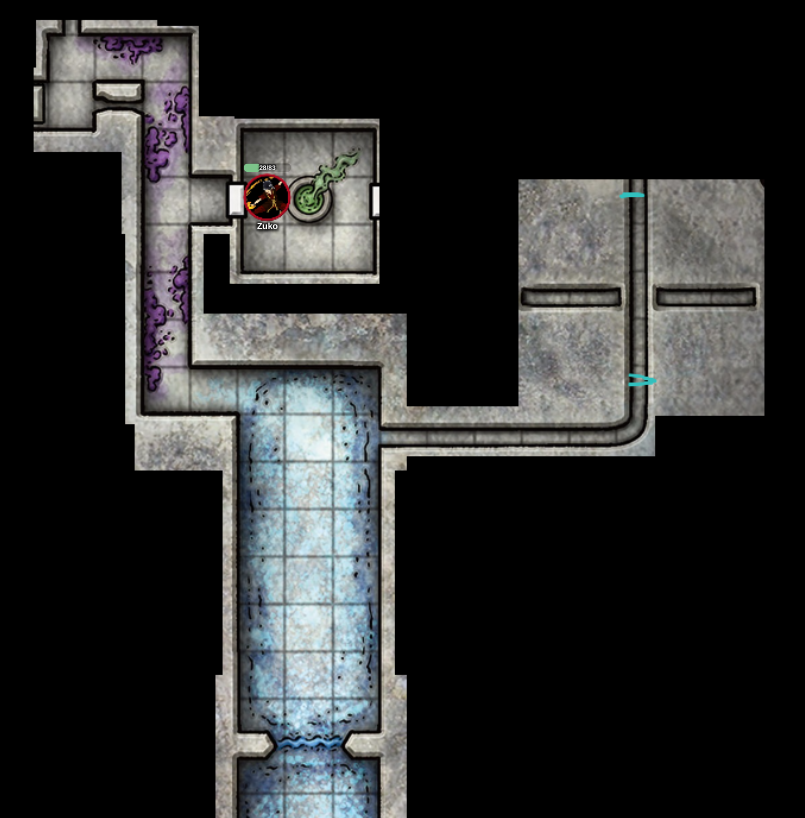
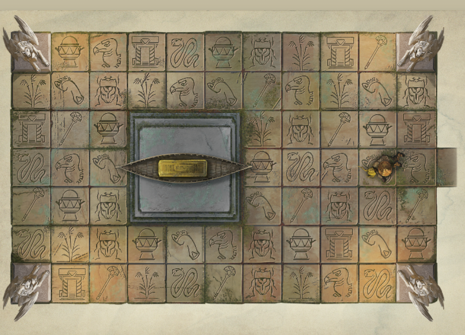

# Campagna

## OMU

stanza delle guardie
 collassata piena di rampicanti, ha dei graffiti scritti in comune:

1. "fear the fangs of ras nsi"
2. "Erik i've gone in search of the nine shines. -V"
3. "puzzle cubes are the key"  
4. "beware of the frog monster"  
5. "who is Unkh?"  
6. "all hale the king of fethers"
7. "the snake are not what they seem"
8. "Kubazan=Bravery. Shagambi=Wisdom. Moa=?"

### 01/10/2022

#### zona 2

Ci avviciniamo in una zona con un fuoco appicato su dei cadaveri, umani e non. i più "freschi" sono stati uccisi con delle armi da taglio, quelli più vecchi sono troppo difficili da identificare perchè bruciati,
in un muro vicino la pila di cadaveri si nota un simbolo di un serpente a spirale che tiene in bocca un cerchio,
rappresenta Dendar the night serpent devouring the world.  
Sentiamo delle grida di aiuto da qualcuno, è qualcuno rimasto bloccato tra le macerie; lo tiriamo fuori.  
Dice di chiamarsi __Orbex__, dice che tutto il opsrto è andato distrutto per via di persone strane, alcuni serpentiformi.  
Faceva parte di una spedizione, si trovava ad OMU (città abbandonata da diversi anni) per i "red wizards" (di fatti nelle vicinanze si notano molti cadaveri con mantelli rossi).  
Potrebbe essere utile portarlo con noi come guida perchè sà leggere le antiche lingue parlate (e scritte) nella città.  
Lo porteremo con noi, ci parla di una antica leggenda.  

    Molto tempo fa, il dio Ubtao indurì il suo cuore e giurò di non piangere più per il popolo di Omu. Le piogge cessarono, la giungla appassì e morì, e la morte spazzò via Omu.  
    Una mattina, un saggio zorbo emerse dal suo albero cavo e parlò agli Omuani morenti. Per convincere Ubtao del loro valore, decise di cucinargli uno stufato fatto con tutte le loro buone qualità. Catturare tali virtù non sarebbe facile, quindi ha chiesto a un malizioso almiraj di aiutarla. Il almiraj infilzò la temerarietà nella pentola, che considerava una virtù, e Ubtao sputò lo stufato quando lo assaggiò. Da quel giorno, Obo'laka lo zorbo e I'jin the almiraj divennero terribili nemici.

    A mezzogiorno, un coraggioso kamadan saltò giù dalla sua roccia. Vide il male nei cuori degli Omuani e decise di lanciarlo come un fastidioso punto di ebollizione. La kamadan ha modellato una lancia sacra, ma l'ha lasciata sulla riva del fiume e un furbo l'ha rubata. Nella sua rabbia, Shagambi il Kamadan dimenticò tutto degli Omuani e inseguì Nangnang il grung per sempre attraverso il cielo.

    Quando arrivò la sera, un astuto eblis uscì dalla sua capanna di canna. Gli Omuani non gli piacevano, ma senza di loro non avrebbe nessuno su cui giocare. Gli eblis mandarono una rana palustre a ragionare con Ubtao, ma la rana era arrabbiata e decise invece di lottare contro il dio. Questo Ubtao divertito, così ha dato i tentacoli alla rana per renderlo più forte. Quando Kubazan il froghemoth tornò a Papazotl gli eblis, inseguì Papazotl nella palude con i nuovi tentacoli.

    Quella notte, un su-mostro fece irruzione nel palazzo di Ubtao e rubò un secchio d'acqua per gli Omuani. Quando il dio venne a correre per trovarlo, il su-mostro nascose il secchio nella tana di un jaculi. Ubtao chiese agli animali della giungla dove era nascosta la sua acqua, e Moa il jaculi era troppo onesto per mentire. Quando Wongo il su-mostro scoprì come Moa lo aveva tradito, giurò di catturare il jaculi e mangiarlo.

    Per tutto il tempo, Unkh la lumaca di flagello visse in profondità sotto la terra. Il rumore degli altri animali che la combattevano la fece scivolare in superficie e quando il giorno spuntò dal suo guscio, la luce accecò Ubtao e gli fece lacrimare gli occhi. La vita tornò a Omu e la gente costruì santuari per onorare gli animali che li avevano salvati.

_in inglese_:

    Long ago, the god Ubtao hardened his heart and vowed to weep for the people of Omu no longer. The rains stopped, the jungle withered and died, and death swept through Omu.

    One morning, a wise zorbo emerged from her hollow tree and spoke to the dying Omuans. To convince Ubtao of their worth, she decided to cook him a stew made from all their good qualities. Catching such virtues wouldn’t be easy, so she asked a wily almiraj to help her. The almiraj.snuck recklessness in the pot, which she saw as a virtue, and Ubtao spat out the stew when he tasted it. From that day on, Obo’laka the zorbo and I'jin the almiraj became terrible enemies.

    At noon, a brave kamadan hopped down from her rock. She saw the evil in the Omuan’s hearts and decided to lance it like a troublesome boil. The kamadan fashioned a holy spear, but she left it by the riverbank and a crafty grung stole it. In her rage, Shagambi the kamadan forgot all about the Omuans and chased Nang-Nang the grung forever across the sky.

    When evening came, a wily eblis stepped from his reed hut. He didn’t like the Omuans, but without them he’d have no one to play his tricks on. The eblis sent a marsh frog to reason with Ubtao, but the frog was angry and decided to wrestle the god instead. This amused Ubtao, so he gave the frog tentacles to make it stronger. When Kubazan the froghemoth returned to Papazotl the eblis, he chased Papazotl into the swamp with his new tentacles.

    That night, a su-monster broke into Ubtao’s palace and stole a pail of water for the Omuans. When the god came running to find it, the su-monster hid the pail in a jaculi’s burrow. Ubtao asked the jungle animals where his water was hidden, and Moa the jaculi was to honest to lie. When Wongo the su-monster found out how Moa had betrayed him, he vowed to catch the jaculi and eat him up.

    All the while, Unkh the flail snail lived deep under the earth. The noise of the other animals fighting made her slither up to the surface, and when day dawned over her shell, the light blinded Ubtao and made his eyes water. Life returned to Omu, and the people built shrines honor the the animals who’d saved them.

| divinita | specie | similitudine |
|--|--|--|
|Obo'laka | zorbo| koala|
|I'jin|almiraj|coniglio cornuto|
|Shagambi|kamadan|leopardo|
|nang-namg|grung|rana|
|kubazan|froghemoth|rana grossa|
|papazotl|eblis|cicogna|
|moa|jaculi|serpente|
|wongo|su-monster|scimmia|

Il __-V__ che ha scritto il messaggio nel bagno è un tizio di una spedizione collegata a quella di Orbex, Erik purtroppo è morto.

Anche il nome Moa era presente nei graffiti del bagno, probabilmente il punto interrogativo sarà qualcosa di collegato a "Moa the jaculi was to honest to lie"  Moa=Honesty?  

Anche Unkh è nella storia.

Cambiamo zona

#### zona 3

Notiamo una piscina rettangolare piena di acqua melmosa, dovebbe essere un tempio, al centro c'è un pilastro con un volto simile a quello di una rana.

Ci avviciniamo al tempio, la porta è chiusa a chiave, c'è una scritta:

    kubazan urges us to tread without fear and to give back as much as we take 

Dalla piscina esce fuori un Froghemoth
Sconfitta ci avviciniamo alla statua della rana dove troviamo una chiave.  
Usiamo la chiave per aprire la porta del cancello.

Troviamo delle spine uscire dal pavimento, al nostro opposto vediamo un dipinto di un Froghemoth Kubazan che combatte con Papazotl the eblis

Massimo ha provato il suicidio ed è caduto sulle spine  

Riesce a risalire e arriva all'altare, dove trova un cubo (la chiave descritta nei murales?), lo prende e si chiudono le porte e comincia ad uscire del gas

Facendo parkour lo riporta indietro, in questo cubo sembra esserci raffigurata una rana (probabilmente esiste un cubo per ognuno degli dei)

### Sabato 08/10/2022

#### zona 4

Ci dirigiamo verso il punto 4 della mappa, ci ritroviamo di fronte quello che credimo un tempio, protetto da due specie di chimere.

Analizzando la porta si trivani deu rilievi in _old nomuan_ che il vecchio sa leggere

    Shagambi teaches us to fight evil with honor

Ci sono anche dei disegni di Shagambi osseva i chultani che si allenano con spade e lance.

Spingendo tutti insieme riusciamo ad aprire la porta

Scendiamo le scale d'ingrsso, ci troviamo (dove sono le stelle) 4 statue di Omuani (abitanti di ohu), le grate sotto coprono una "fossa dei gladiatori".
Oltre la fossa si vede un piedistallo vuoto.
Dietro si nota un disegno di un leopardo che combatte con una rana tozza (shagambi che combatte con Nang nang)

Massimo ritenta il suicidio e si butta nella fossa dei gladiatori.

Lo seguiamo scendendo dalle scale, delle statue di terracotta raffiguranti gladiatori romuani ci attaccano.

Riusciamo a sconfiggerli con molta difficoltà.  
Le loro lance di metallo sono rimaste a terra

### Sabato 15/10/2022

Prendiamo le lancie e le portiamo al piano superiore, le mettiamo in mano alle statue che avevano un buco nelle mani preciso per le lance.

Una volta inserite tutte le lancie dal piedistallo esce fuori un cubo come quello ritrovato nel tempio precedente.

#### zona 5

Ci avviciniamo al picco che punta verso il punto 5 della mappa, al ponticello si nota un gruppo di mostri.

Sembrano essere dei vegepigmi (simili agli zulugorgi ma più grandi Tra di loro c'è un grung, legato con delle corde, sembra stia per essere sacrificato dai vegepigmi).

Massimo prova ad interagire con gli esserini, finirà male come al solito.

Massimo decide di ballare con loro.

Uno dei vegepigmi più grossi butta il grung nella lava, altri due lo seguono.

Ballando, gli animaletti e Massimo si avvicinano verso il bordo, Massimo però salta via per evitare di finire come gli altri caduti di sotto.

Ci attacano.  

Una volta sconfitti cerchiamo un modo per scendere ma non sembra esserci.

Visro che non ci è possibile andare verso il punto 6, ci dirigiamo verso il punto 7

#### zona 7

Ci ritroviamo un di fronte ad un ponte improvvisato con un tronco d'acqua.  
Si nota abbastanza bene che una parte della città è stata sommersa da questo fiume, che si siano rotti gli argini del fiume con il passare del tempo?

Massimo prova ad attraversare il ponte, ma viene subito colpito da una freccia

Ci attacca quello che sembra essere un ladro, a metà del fight tenta di fuggire. Mentre gli altri lo inseguono io distruggo il ponte da cui siamo entrati, per evitare che il tizio scappi da dietro.  

### Venerdì 21/10/2022

Dopo esserci riposati ci dirigiamo verso il punto 8

#### zona 8

Arrivati passando per la lunga strada di cemento arriviamo al tempio  

All'entrata ci sono due colonne, in cima ad entrambe è presente una statua di una lumaca.

Andiamo nella piccola struttura sulla sinistra, sembra essere un vecchio ripostiglio abbandonato.

La porta non c'è piuù, il tetto è crollato e sembra essere tutto rovinato. Notiamo però un centinaio di chiavi di ferro appese alle pareti, alcune vecchie, alcune rotte o arrugginite; comunque alcune sembrano poter essere ancora utilizzabili.

Ci avviciniamo alla struttura principale,

c'è una scritta sopra la porta

    Unkh urges us to contrast all options before acting

Spingendo tutti insieme riusciamo ad aprire la porta.

All'interno vediamo:

  

Appena entrati vediamo una statua con dientro un piedistallo piedistallo (come quello del tempio precedente). Nel nuro sono presenti delle insenature, ognuna con una chiave di ferro come quelle trovate prima.  

La statua raffigura una lumaca come quella della storia con Unkh  

Da dietro la statua escono fuori 3 ghast con la forma di chultiani (ex abitanti di Chult).

Dopo averli sconfitti notiamo che sul piedistallo c'è una serratura, troviamo la chiave corretta e recuperiamo anche il cubo di  Unkh  

Massimo si avvicina al punto 6 per vedere se c'era qualche cosa che ci potesse far attraversare il lago di lava.  

#### zona 6

Facendo una fionda con un albero (molto improvvisata) Massimo riesce a "volare" sino quel punto.  

Questo è quello che vede massimo:  

Il tempio non ha porte, sull'uscio dell'entrata escono fuori 4 serpenti grandi che attaccano Massimo

Massimo scappa entrando nel tempio.
Trovi un corridoio che porta a 3 stanze  

Con lo stealth, nella stanza a destra trova molte ragnatele una statua con un cubo (come quelli che abbiamo già recuperato) nelle sue fauci

Nella stanza a sinistra trova la stessa situazione, tranne per la statua che invece è distrutta e il cubo si trova per terra.

Nella stanza centrale sono presenti diverse balestre che puntano tutte al centro della stanza, dove è presente un mosaico ricorperto di muschio, inoltre è presente anche un piedistallo con ancora un cubo sopra.

Nel mosaico è rappresentato un serpente aggrovigliato su di una scimmia, in alto all'immagine vede una scritta, però non è in grado di comprenderla.  

Massimo si avvicina all'altare e con la spada spinge il cubo giù dal piedistallo lasciandolo cadere, le statue e le balestre si animano e lo attaccano.

Massimo rimane stabile ma morente in mezzo alla stanza.

Giacomo si è accorto di avere della corda, unita a quella di Gino Frollino siamo riusciti a fare una corda abbastanza lunga per poter attraversare il lago.

Arriviamo all'entrata del tempio e combattiamo con i serpenti.  
Li sconfiggiamo ed entriamo dentro.  
Arriviamo nella stanza in cui Massimo è stato ammazzato, le scritte sul mosaico dicono:

    Moa teaches us that secrets hide the truth  

    Death rewards a thief deceived. Truth comes from the serpents mouth  

Giacomo vuole provare a prendere il cubo da per terra e correre via, lo aiuto curandolo e dandogli + classe armatura

Riesce ad uscire fuori ma il cubo si dissolve alla luce del sole.

Dopo diversi tentativi, notiamo che nella stanza con le balestre c'erano delle porte nascoste che portavano alle altre stanze. Prendiamo il cubo della stanza a destra partendo dall'entata.

Usciamo dal tempio.

### Friday 28/10/2022

Ce ne andiamo dall' "isola" come nello stesso modo con cui ci siamo arrivati, con le corde.  

#### zona 9

Andando verso la zona 9 passiamo per il punto 7, dove ho rotto il ponte, quindi tocca usare l'incantesimo per attraversare l'acqua.  

Arrivati troviamo un campo abbandonato con delle tende distrutte e dell'attrezzatura da campeggio abbastanza arrugginita.  
Al centro del campo si vede un palo con una bandiera gialla improvvisata con uno straccio rovinato  

In una delle tende Massimo trova una pergamena arrotolata:

    Rue,
    Devlin has a lead on the Eye of Zaltec! The old goat found an obelisk to the north that masks the entrance to the Tomb of the Nine Gods. The Eye must be within, but the door is magically locked. We think the secret to opening it lies in the holy shrines.
    We've headed into the ruins to check them out: Gods willing, we'll be back tonight. Ras Nsi's serpent people are on the prowl, so be careful. If you get into trouble, sound the swan horn twice and we'll come running.
    For the Yellow Banners,
    Lord Brixton

Rubo la bandiera, nel mentre Giacomo decide di urlare (ha meno 1 a intelligenza)  

Grazie all'urlo, 3 uomini ci raggiungono, tra cui 2 avventurieri e un anziano con un cappuccio rosso, come quello dei compagni di Orbex.  

Massimo muore in combattimento, io ci vado molto vicino.  

### Friday 05/11/2022

Ci riposiamo, piangiamo la morte di Massimo (lol) e decidiamo di continuare verso il punto 10.

Prima di incamminarci sento qualcuno rovistare dietro di me, è un piccolo goblin che rovista nei cadaveri dei combattenti della scorsa volta.

Il goblin (Massimo) vuole unirsi a noi, però  non ci convince e per questo ci avviamo al punto 10 senza di lui.

Il goblin ci segue di nascosto.

#### zona 10

Arrivati al tempio, entriamo nel cortile recintato, troviamo un'incisione di un coniglio cornuto che sta caricando un simil orso (piccolo) con degli artigli affilati.  
Oltre all'incisione c'è un messaggio che viene tradotto in

    I'jin teaches us to take the path least expected.

Entriamo dalla porta principale, per terra troviamo delle incisioni

Oltre al pavimento con le iscrizioni c'è altro pavimento e poi un muro

Risolviamo l'enigma passando nella colonna tutta a sinistra.
Oltre questo corridoio troviamo un bivio, ci separiamo e ci ritroviamo in un labirinto.

Massimo riesce a trovare il cubo e incontrandomi nella strada per tornare indietro me lo passa, così lo aggiungo agli altri cubi.

Una volta fuori vede all'ingresso un coniglio con un corno (almiraj), torna indietro e si nasconde dietro un muro, dove trovo anche io il coniglio cornuto.

Come ci siamo avvicinati per uscire il coniglio è scappato via.

Decidiamo di continuare ad andare avanti e ci dirigiamo verso il punto 11

#### zona 11

Nella strada per arrivare al punto notiamo dei cespugli che si muovono, da lì escono fuori dei goblin, li uccidiamo.

Arriviamo al punto, troviamo un carro ribaltato, con petali di fiori sparsi intorno e nidi d'ape nelle ruote.

Una ghirlanda di fiori è stata appesa sul traino del carro.

Gino Frollino trova sotto il carro, un disco ricoperto di muschio con scritte in comune e in caratteri cuneiformi

in comune è scritto

    Queen Napaka proclaims the free people of Omu fear nothing. Brave new gods protect us, as Uptao did before but thats no longer. Omu will rise again, and Napaka shall reclaim all that is hers by right of conquest

Con questo disco possiamo tradurre tutte le scritte anche senza l'aiuto del vecchio, che è morto punto da un'ape, evidentemente era allergico e la medicina qui non è andata molto avanti.

Ho pregato Dio e sono riuscito a dar fuoco ai vestiti di Nanni pupu  

Decidiamo di dirigerci verso il punto 12

#### zona 12  

Mentre ci incamminiamo notiamo che le api ci seguono, notiamo anche un odore di miele.
L'odore proveniva da uno zulugorgi che si è nascosto nei miei pantaloni, mi ha anche dato uno charm

    Charm of Snowball Strike

    This charm has 5 charges. As a bonus action, you can expend 1 of the charm's charges to create a magical snowball in your hand and throw it. You must have a hand free to hold the snowball, or the charge is wasted. The snowball is a magic ranged weapon with which you are proficient. It has a normal range of 20 feet and a long range of 60 feet, it deals 1d4 cold damage on a hit, and it scores a critical hit on a roll of 19 or 20. If you score a critical hit with the snowball, the target is blinded until the end of its next turn. The snowball vanishes immediately after you hit or miss with it, or at the end of your turn if you don't throw it. Once all its charges have been expended, this charm vanishes from you.

Lo chiamerò Gimapiero.

### Friday 16/12/2022

#### zona 13

Massimo è pazzo e da solo decide di andare alla zona 13 invece di 12, arrivati vediamo un anfiteatro in rovina cirocndato da statute di animali, per tutta la zona il terreno è fangoso e privo di vegetazione, completamente in silenzio.  

Giacomo decide di entrare nel teatro e urla sperando di attirare l'attenzione di qualcosa  

Arrivano dei dinosauri che ci attaccano.

Una volta sconfitti arriva anche un trex  

Lo abbiamo sconfitto e io sono salito al livello 7

### Sunday 25/12/2022

#### zona 12 II  

Dopo la deviazione al punto 13 ci dirigiamo finalmente al tempio del punto 12  

Trovimamo una recinzione di cemento con all'ingresso 2 colonne di cemento, raffiguranti delle scimmie a testa in giù.

All'interno della recinzione ci son cespugli, un albero e 5 arcate, quella più a destra ha un cancello di ferro chiuso, gli altri sono aperti.

Sopra l'arcata centrale (chaive di volta) c'è scritto un messaggio in old omuan  

    Better to be Wongo's friend than his enemy

Massimo e Giacomo sentono delle scimmie che gli urlano nel cervello

Decidiamo di entrare dall'arcata centrale, da lì arrviamo in una stanza con una statua di una scimmia con gli arti rivolti verso l'alto.

Sotto la statua è scritto

    Wongo's friend knows where to pour the water 

Inoltre ci sono 4 maschere nei muri raffiguranti diversi animali

- L : Lion
- B : Boar
- Z : Zebra
- V : Volture

 All'opposto dell'entrata c'è una scena di combattimento tra Wongo e Moa

 Emanuele decide di entrare nella seconda arcata da sinistra (Boar), trova una scritta :

    The volture is lucky to be alive

Decide poi di andare alla prima entrata a sinistra (Lion)

    I ate one of the Boars friends

Poi va alla 4 entrata da sinistra (Zebra)

    My only friend starved to death

Decido di guardare attraverso la maschera del cinghiale, vedo un raggio di luce blu che punta al piede sinistro della statua.  

Emanuele guarda attraverso la maschera della zebra e vede una luce blu che punta al piede destro della statua

Massimo fa la stessa cosa con la maschera del leone ma verso la mano destra della statua

Io e Emanuele riusciamo ad aprire il cancello, facendo passare Massimo attraverso, quindi riesce ad entrare nell'ultima arcata, arriva alla maschera e nota un raggio che arriva alla mano sinistra della statua

La scritta sotto la statua dice:  

    One of the other has no friends  

Decidiamo di versare dell'acqua nella mano destra della statua, perchè il leone sembra essere l'unico senza amici.  

Nel momento in cui Giacomo versa l'acqua nella mano destra, nota che escono degli zampilli d'acqua che si trasformano in mostri, steam mephit  

Li abbiamo uccisi, ma non è successo nient'altro. Versa l'acqua nella mano sinistra della statua. Da lì l'acqua si illumina e esce fuori il cubo dalla testa della statua.

Dopo aver parlato nel pensiero con Giacomo, scendono dal soffitto 4 su-monster (scimmie), che ci attaccano.  

Le sconfiggiamo e prendiamo il cubo.

### Friday 06/01/2023

#### zona 15  

Dopo essere usciti dal tempio decidiamo di entrare nel capannone al lato opposto della strada in cemento.  

Il capannone è il rimanente di un vecchio mercato, smbra essere pieno di trappole, Massimo tenta di disinnescarne il più possibile ma Giacomo inciapa su di un filo di scatto.  
Vicino a Giacomo appare una figura piccola quanto Massimo che corre tra le scatole e macerie.

Passando vicino a dove è apparsa questa figura notiamo una botola,

### Saturday 28/01/2023 22:37  

#### zona 15 II  

Scendiamo nella botola camminando, Giacomo scende rotolando.  
Alla fine delle scale troviamo dei koboldi che circondano il corpo di Giacomo incastrato in delle scatole.  

Questi koboldi non sembrano esserci ostili, dicono di lavorare per un mago oscuro che controlla l'intera città, Acererak, che sta creando un esercito di koboldi trasformati in draghi.  

Massimo dona al koboldo capo una lama di ghiaccio facendola poi cadere e distruggere (come heisengerg breaking bad) per fare scena. Il coboldo contento della piccola esplosione ci lascia andare senza problemi, chiede di portargli anche altri doni per mantenere l'amicizia.  

Giacomo solo al sentire questa richiesta tira un pugno al koboldo (Giacomo è un pelo antisemita).  

Uccidiamo tutti i koboldi  e ritorniamo in superficie

#### zona 16  

Decidiamo di avviarci verso la zona 16 che è in parte sommersa.  
All'entrata del tempio si vedono 4 coccodrilli vicino l'entrata del tempio.  

Un recinto di mura in rovina, con 2 colonne all'entrata, disegnati sopra ci sono rilievi di un uccello con lunghe gambe e becco appuntito. Si intravedono delle scale piene di muschio che vanno verso l'alto.  

Uccidiamo tutti i coccodrilli.  

### Saturday 04/02/2023 23:18  

#### zona 16 II  

Entriamo nell'anticamera del tempio.  

Sopra la scalinata si vede una scritta:  

    Papazotl teaches us to bow before no one

Per terra invece si vede un rilievo di Papazotl e Kubazan che comabattono  

La porta è troppo pesante per spingerla da solo, perciò la apriamo tutti insieme.  

Nella stanza successiva, al centro troviamo un piedistallo con niente sopra, ai lati ci sono 6 statute (3 e 3) che guardano il centro della stanza. Hanno tutti il corpo umano ma con teste di animali.  

Partendo da sinistra andando in alto e poi scendendo verso destra, le statue hanno la test dei seguenti animali  

- lucertola lizard
- giaguaro jaguar
- aragosta lobster
- tucano tucan
- pipstrello bat
- rana frog

Sul piedistallo al centro della stanza c'è un incisione scritta in comune  

    Comes with sunshine
    Leaves with night
    Hides in darkness
    Does not bite
    Always joined to its caster
    Never strays from its master

La soluzione è ombra, Massimo fa luce con una torcia verso la statua del pipistrello, nota che la parete dietro la statua svanisce.  

Entra nella stanzina dietro la statua e trova, attaccato al muro verso sud una griglia:

Comeswithsunshi  
neLeaveswithnig  
htHidesindarkne  
ssDoesnotbiteAl  
waysjoinedtoits  
casterNeverstra  
ysfromitsmaster  

co.............  
.....v.........  
.....e.....r...  
............e..  
..y............  
.........e.....  
...........s...  

Copriamo gli occhi delle statue con stoffe che avevamo negli inventari, da qui esce fuori un cubo dal piedistallo  

Dopo aver preso il cubo decidiamo di dirigerci indietro per il punto 14  

### Saturday 11/02/2023 23:14  

#### zona 14  

Entriamo in un edificio abbandonato ch everte nelle stesse condizioni delle altre sturtture nella città (strutture erose e piene di rampicanti).  

Andando avanti ci troviamo un muro

Da quel che vediamo sembra evidente che servano tutti e 9 i cubi per poter proseguire, per questo decidiamo di cambiare zona e di andare verso la zona 17.  

#### zona 17

Torniamo verso il punto 16 e poi continuiamo verso nord est.  
Arriviamo al cospetto di una cascata e nel mentre che camminiamo Emanuele inciampa in un sasso e casca in acqua. Mentre è in acqua riceve una visione, dove vede dalla prospettiva di una persona in cima alla cascata che guarda verso la città. La città non èancora in rovina, ma vede che dal centro della città si sviluppa una palla di fumo che diventando sempre più grande e si avvicina verso di lui, si gira verso i suoi compagni (non noi ma i compagni di questo tizio di cui ha visto i "ricordi") e poi si ri-gira verso la palla di fumo che magicamente è scomparsa.

Giacomo tira su Emanuele da per terra, intterrompendo quindi la visione

Massimo è affaticato perchè ha bevuto dell'acqua non potabile,
(probabilmente è dovuto alla diarrea incessante venuta bevendo l'acqua)

Decidiamo quindi di muoverci verso il prossimo punto

#### zona 18  

Arriviamo in quello che sembra essere un nuovo tempio, aggiriamo le mura e arriviamo all'entrata dove troviamo le solite colonnine.  

Come arriviamo veniamo sorpresi da delle freccie che per fortuna non ci colpiscono, vediamo questa scena  

I mostri che ci attaccano sono:  

Uccidiamo tutti i mostriciattoli.

Andiamo per aprire la porta, notiamo che al contrario di altri templi non ci sono scritte in alto. La porta è difficile da aprire.  

Dopo diversi tentativi riusciamo ad aprire la porta

### Sunday 19/02/2023 21:44  

#### zona 18 II  

Entriamo nel tempio, troviamo diversi forzieri di marca masterlock.  

SUll'altare di fronte all'entrata c'è una scritta

    Nangnang teaches us to serve only ourselves  

Dietro l'altare c'è una porta con una scritta incisa sopra  

    Whoever among you is the richest, bring me your gifts

Massimo decide di porgere in dono il suo seme e viene sull'altare, dal goblin secernono 7ml di liquido seminale  

Provo a mettere una moneta d'oro nel piedistallo e non succede nulla, nel riprenderla sfioro del liquido seminale di Massimo. Adesso ho l'aids, passando completamente la fase dell'hiv  

Massimo trova un vaso pieno di liquido strano, e decide di aggiungere il suo seme al liquido, Giacomo ha provato a picchiare Massimo per fargli smettere di venire su ogni cosa, sbaglia mira e prende il vaso. Il goblin viene inondato dal contenuto del vaso  

Tutte le casse e le altre giare sono piene di monete e gioelli, che però se vengono portati fuori dal tempio diventano semplici pezzi di metallo  

il mosaico per terra raffigura:  

    Una figura umanoide a forma di rana che mena un leopardo con dei serpenti che gli escono dalle spalle  

Giacomo prende delle monete dalle casse e le mette di fronte alla porta, che poi si apre.  

Vado a prendere il cubo e lo aggiungo agli altri.  

Facciamo un long rest e Emanuele mi cura dall'aids  

Nel mentre che ci riposiamo nel tempio Emanuele sogna di essere da solo nelle vie della città in rovina. In lontananza vede una figura incappucciata, con un bastone che cammina da solo.  
Questa figura si gira verso di Emanuele, che nota che degli occhi infuocati e il volto scheletrico. Il bastone ha un teschio legato al bastone.  

Ci incamminiamo verso la zona 19.  

Mentre camminiamo vediamo dei serpenti correre verso di noi e ci attaccano.  

Sconfiggiamo i serpenti e continuiamo la strada per arrivare al punto 19  

### Saturday 25/02/2023 22:19  

#### zona 19

Siamo arrivati al tempio  

C'è una scritta all'entrata

    Obo'laka teaches us to tread warily and stay in the light

La porta è socchiusa e i cardini sono arrugginiti, metto dell'olio (dalla mia borraccia infinita) e apro la porta  

troviamo degli zorbi che ci attaccano  

Dopo averli sconfitti entriamo all'interno del tempio.  

Nei muri si vedono immagini di vita comune omuana, caccia, raccolto e altre scene. Otto (8) in totale  

Sotto ciascuna delle immagini c'è un porta torce dove è possibile inserire una torcia  

Alla fine del corridoio si nota una porta di legno molto vecchia  

Entrando nella stanza troviamo una piscina con dell'acqua dentro e sul soffitto, esattamente sopra la piscina è disegnato un sole  

L'acqua della piscina è limpida e senza increspature  

Giacomo cerca dei pesci nella piscina ma mentre si avvicina Massimo si butta dentro. Giacomo si accorge che nel riflesso dell'acqua il sole disegnato sul soffitto diventa una luna, nel mentre, Massimo non risale dalla piscina, sembra essere scomparso  

Anche Giacomo si tuffa e scompare nella piscina.

Massimo ritorna e salta fuori dalla piscina senza pantaloni, dice a me ed Emauele che c'è una stanza sotto la piscina  

Decidiamo di scendere tutti nella piscina per vedere la stanza  

Ci ritroviamo in una stanza uguale a quella di prima ma con i disegni visti nella stanza precedente (disegni di vita quotidiana dei romuani). Guardando il riflesso della piscina si vede il sole e nella stanza c'è una porta di legno

Apro la porta, ed entriamo in una stanza completamente diversa

Nel momento in cui entriamo nella stanza notiamo il solito altare, con un mosaico dove viene rappresentato

    un koala che combatte con un coniglio cornuto

Al centro della stanza c'è un piedistallo e di fianco c'è una statua di un tizio pelato con un mantello, sembra quasi che sia stato pietrificato mentre provava a prendere il cubo.

Dall'aspetto ricorda uno dei maghi rossi che abbiamo già incontrato in precedenza  

Tornando nella stanza con la piscina e la luna nel soffitto Giacomo nota una stanza segreta ma la porta è chiusa e non si apre.

Emanuele e Giacomo Corrono verso la porta e riescono a sfondarla aperta.

Illuminando la stanza notiamo una striscia di sangue non fresco che si prolunga fino alla fine del corridoio,dove troviamo un cadavere di un mago vestito di rosso come quello trovato nell'altra stanza. Notiamo anche che c'è una porta bloccata con delle assi di legno e notiamo che sul muro, scritto con il sangue c'è una frase:  

    Ras Nsi claims the keys to the Tomb of the 9 Gods

Aprendo la porta portiamo le torce nella prima stanza e le posizioniamo nei corrispettivi poggia torce. Sentiamo un meccanismo attivarsi e tornando nella stanza con il piedistallo lo troviamo aperto ma senza il solito cubo da poter prendere.  

Ne deduciamo che le stesse persone che hanno rubato il cubo hanno anche ucciso le persone che abbiamo trovato qui morte.  

### Sunday 12/03/2023 22:06  

#### zona 20b

Superiamo il muro circolare e notiamo come per tutte le altre zone della città, molte case diroccate piene di piante rampicanti.

Tra le case e la vegetazione troviamo per terra dei segni di trascinamento che portano verso un tunnel, le tracce sembrano anche abbastanza recenti. Decidiamo di entrare nel tunnel.  

Come ci avviciniamo all'entrata vediamo dei serpenti semi umanoidi, che poi ci attaccano.

Una volta sconfitti entriamo nel tunnel.

Questa galleria sembra essere stata scavata, e più ci addentriamo e più aumenta l'umidità nell'aria.  

Arriviamo in una specie di lago sotterraneo dove troviamo dei yuan-ti broodgard  che ci attaccano.  

li abbiamo uccisi e io non ho curato Emauele, non se lo merita.

### Sunday 19/03/2023 22:02  

#### zona 20b II

  

Giacomo e Massimo notano una porta, e decidono di aprirla, nel mentre io e Emanuele andiamo verso sinistra per vedere altre strade.  

Giacomo e massimo vengono attaccati da degli zombie dopo aver aperto la porta per la stanza

Una volta eliminati andiamo indietro e finiamo in una stanza con degli ostaggi e altri mostri già visti prima, li sconfiggiamo.

### Saturday 13/05/2023 22:15  

Torniamo nella stanza con la porta chiusa, Giacomo riesce ad aprire la porta con un tiro fortunato, entrando vede delle casse di stoccaggio.  

Cercando tra le casse trova l'equivalente in materiali di 5 explorer packs.  

Anche Emanuele e Massimo entrano nella stanza e cercano all'interno delle casse.

Notano che una delle casse è sigillata.  

Riescono ad aprirla, e dentro trovano delle strane candele viola(tavolette d'incenso).  

Massimo deci di accenderne uno, creando una nube di fumo di raggio 20 attorno a noi.  

Emanuele e Massimo rimangono intossicati dal fumo e attaccano Giacomo, che decide di allontanarsi per evitare di rimanere nella nube velenosa.  

Nel mentre, mi sposto verso il lago e parlo con gli ostaggi, chiedo il perché della loro prigionia e se per caso avessero visto passare i maghi rossi qui sotto, Rispondono dicendo di essere schiavi degli uomini serpenti, e di non aver visto nessun mago o altra persona diversa da i loro padroni.  

Nel mentre, Emanuele e Massimo continuano il loro trip di acidi, fino a quando un serpente gigante non cade da sopra il soffitto attaccandoli.  

Siccome non vedo più segnali di vita li raggiungo e li aiuto ad uccidere il serpente.  

Facciamo uno short rest.

Continuiamo ad andare avanti per il corridoio  

Massimo riesce ad aprire una porta e trova stanza con un burrone, il resto di noi continua per il corridoio fino ad arrivare ad una stanza enorme, al centro della stanza c'è una fontana di sangue decorata con delle statue di  teste di sepente gigante.  

C'è una rampa per salire al lato a sinistra e un entrata sulla destra.  

Al centro della stanza c'è un calderone acceso, con dentro uno stufato di carne  

In alto sopra le statue delle teste di sepenti c'è un balcone alto circa 40 piedi.  

Massimo segue il sentiero nella stanza, nota che in fondo al burrone ci sono tanti serpenti da non far vedere nemmeno il pavimento. Decide di sbirciare nelle stanze e attira l'attenzione di diversi mostri che iniziano ad inseguirlo.  

Massimo corre nella stanza dove ci troviamo noi e ci avvisa dell'arrivo di decine di mostri  

Siamo a metà di un figth

### Sunday 21/05/2023 01:20  

Giacomo suona il gong, combattiamo con altri mostri, sopravviviamo per poco  

### Monday 31/07/2023 00:20  

Decidiamo di andare nella stanza a sinistra del gong, li troviamo un basilisco e un altro mostro che fanno da guardia ad un triceratopo rimasto rinchiuso in una gabbia, nel mentre che combattevamo i due tizi, arrivano altre guardie che si erano dileguate la scorsa volta.  

Per poco ci moriamo e proprio per questo Massimo decide di fare il cretino e spara al triceratopo, che in preda al panico rompe la gabbia e si schianta nella stanza a nord di quella in cui ci troviamo ora.  

### Saturday 30/09/2023 23:13  

Scendiamo nella stanza a sud, nelle pareti del corridoio si vedono diverse scene in basso rilievo

    The wall reliefs show the legend of Dendar the Night Serpent and the rise of Ras Nsi. Characters who examine them see the following tableaus:
    A giant serpent coils in the underworld, devouring the dreams of sleeping creatures.
    Yuan-ti terrorize Chultans, feeding their nightmares to the great serpent.
    A [yuan-ti malison] (Ras Nsi) wielding a flaming sword and wearing a gold crown set with a black opal leads the snake people to a great door to the underworld.
    The door to the underworld opens, releasing the serpent. It devours the sun and plunges the world into terror and darkness.

Massimo nota che sopra una porta chiusa c'è un pulsante ambrato, lo preme e inizia ad uscire del gas soporifero che stende lui e Emanuele.

Li sposto dalla zona del veleno e li faccio risvegliare, visto che non si riesce ad aprire la porta in quel corridoio decidiamo di salire dove il triceratopo ha fatto i danni ed è rimasto stordito.

Andando nel corridoio verso destra veniamo attaccati da dei mostri, dopo averli uccisi notiamo che c'è una persona rinchiusa in una stanza.  

Prima di parlare con lei riusciamo a fare un long rest  

Come proviamo a parlarle ci inzia a menare insieme ad un elementale che ha fatto spawnare da un vaso.

### Saturday 28/10/2023 21:57  

Ci spostiamo nella stanza sopra, troviamo 3 uomini serpenti che ci attaccano.  

Dopo averli sconfitti vediamo che per terra c'è una specie di pozzanghera, Massimo prova a metterci una mano e ne esce con la mano sporca, prova a ingannarci dicendo che la sua mano è piena di cacca. Capiamo tutti che è una scemenza e sappiamo che è fango.

Massimo decide quindi di buttarsi facendo un salto carpiato in avanti, cade nella pozza e nel mentre che affoga nella pozzanghera vede in sogno un serpente scheletrico.

Inoltre rimarrà senza sensi per un giorno.  

Giacomo lo trascina fuori dalla pozzanghera,usciamo dalla stanza per vedere se c'è un posto sicuro dove poter lasciare Massimo così da non doverlo portare per forza in giro.  

Come rientriamo nella stanza notiamo che il corpo di Massimo non c'è più e non c'è stato nessun segno di trascinamento oltre a quello lasciato da Giacomo per riprenderlo.  

Facendo un check con arcana sembra che questa pozzanghera venga utilizzata per dei sacrifici, forse Massimo è stato sacrificato.  

Giacomo nel mentre nota che la stanza a destra è bloccata da una grata, nota poi una leva (dal lato interno della stanza) così riesce ad aprire la porta.

Nota 4 carrucole con ognuna collegata una gabbia calata all'interno del terreno. al muro a nord della stanza c'è un simbolo strano che però non riusciamo a interpretare.  

### Saturday 04/11/2023 22:20  

Ritorniamo nella stanza con le fontane di sangue e ci avviciniamo alla porta chiusa in alto a destra, che sembra essere un normale portone di pietra

Mi avvicino alla grata in basso a destra, guardando attraverso le grate noto un corridoio con una fitta nebbia rossastra.

Scendiamo sotto dove eravamo già arrivati, nei bagni/spogliatoi dove avevamo già trovato degli schiavi.

C'è una stanza con un piccolo pilastro che sembra utile solo a reggere il soffitto

Emanuele prova ad interagire con gli schiavi chiedendo se per caso qualcuno fosse uscito dalla stanza con qualcosa, 2 uomini con delle lance e un uomo serpente sono usciti da lì.  

Ci spostiamo nella stanza a destra della pozza di veleno e troviamo una porta di legno. Emanuele la butta giù con un eldric blast  

La porta di legno da verso dell'acqua, che avevamo già visto quando eravamo entrati nel dungeon.  

Giacomo si butta in acqua per vedere quanto è profonda.  

Esce fuori un hydra, che ci apre il culo.

Scappiamo e ci riposiamo.

Nel mentre Massimo si sveglia crocifisso in un dungeon, aprendo gli occhi vede il serpente scheletro che aveva visto in sogno.  

Andiamo verso la porta che l'altra volta aveva buttato giù Emanuele e Massimo con il gas, scopriamo che è bloccata da arcane lock.  

Decidiamo di andare nella stanza dove è scomparso Massimo e fare lì un long rest.

In sogno ci appare il serpente di ossa che ci dice:

    the password is: so ukurlahmu has spoken

Proviamo di nuovo ad andare alla porta e sentiamo delle voci che sembra essere quella di Massimo.

Riusciamo ad aprirla in qualche modo e entriamo nella stanza.

Troviamo Massimo praticamente crocifisso, spawnano il serpente di ossa e altri due mostri, li sconfiggiamo e liberiamo il nostro goblin tutto infangato.  

### Saturday 30/12/2023 23:21  

Ci spostiamo di nuovo nella stanza con la fontana di sangue, proviamo tutti insieme ad aprire la porta di pietra, e ci riusciamo.

Entriamo in una stanza che si affaccia al fiume sotterraneo dove avevamo trovato l'hydra, troviamo un gruppo di uomini serpente e altri mostri e li sconfiggiamo.

### Saturday 13/01/2024 22:34  

Giacomo si siede sul trono, noto una leva sulla base e lui la preme, si apre poi una stanza alla destra del trono.

La stanza è piena di tesori e monete, in fondo alla stanza su un cumulo di cuscini è seduto un uomo serpente (ras nsi) completamente bendato.

Giacomo decide di parlargli, sembra di sentrire due persone che litigano su tiktok.

Tizio decide quindi di menarci

Riusciamo a sconfiggerlo.

In un tavolo nella stanza troviamo l'ultimo cubo che non avevamo trovato nell'ultimo templio.  

### Thursday 31/10/2024 23:09  

Decidiamo di ripercorrere il fiume per cercare l'hydra, verso metà troviamo un cunicolo dove c'è della melma corrosiva sul soffitto.

Massimo spara fuoco sulla melma e pulisce tutto il soffitto ma non succede nulla di particolare.

Decidiamo di ritornare alla stanza con la fontana di sangue perché manca ancora una stanza dove non siamo riusciti ad entrare.

Nel mentre che Giacomo picchia le sbarre per provare a romperle massimo prova a bussare ai muri che si trovano a sud di dove dovrebbe essere la stanza.

Massimo prova a lanciare dardi di fuoco nella stanza per illuminarla, viene colpito da un muro di fuoco che lo bruciacchia.

Corspargiamo Massimo di maionese, con la forza siamo riusciti a farlo entrare attraverso le sbarre.
L'unica cosa che nota nella stanza sono 3 stanze con dei letti, una fontana di acqua pulita al centro e una pedana per il teletrasporto che non possiamo utilizzare.

Con la forza riusciamo a ritirare fuori dalla stanza Massimo ma si sloga una spalla.

Visto che non c'è più niente da fare decidiamo di uscire da dove siamo entrati.

Ci ritroviamo quindi ci ritroviamo verso il punto 20B, decidiamo di andare verso il punto 14.

Ci troviamo di fronte ad un obelisco con del muschio nero, un breve tunnel di fronte noi e all'obelisco, mentre a destra c'è un corridoio con delle statute

Giacomo si avvicina alle statue che rappresentano 8 dei nove "dei" per cui sono stati creati i templi, sotto ciascuna statua ci sono delle piccole ciotole per i falò.

Manca la statua di Unhk

Massimo e Giacomo li accendono tutti, li spengono, li riaccendono, fanno una capriola, parlano in serpentese "cisì asà o'sò", prova anche il casertese.

Giacomo nota un dettaglio, le statue sono posizionate in base alle rivalità.

Come mi avvicino alle statue si accendono man mano tutti i falò, come si accendono gli ultimi due falò si apre dalla fine del corridoio un'ultima statua, quella di Unkh

Nella statua di Unkh, legata al collo c'è un pendente d'oro a forma di occhio.
Massimo prova a prendere la collanda, ma da bravo bimbo speciale decide di cavarsi un occhio per mettere la collana a forma di occhio al suo posto.

La collana è troppo grande per il suo cranio e perciò si è cavato un'occhio per niente.

Massimo si è appena rimangiato tutto.

L'occhio ce l'ha ma è di vetro.

Prendo io la collana e la metto al collo.

Mi allontano dalle statue e vado verso l'obelisco, noto che ci sono delle scritte nascoste dal muschio, grattiamo via il muschio. Nel mentre sentiamo dei rumori dalla scarpata sopra di noi, sono 3 gargoyle che ci guardano dall'alto.

Giacomo prende un sasso e lo lancia ai gargoyle e lo prende.
Scendono e ci menano.

Li battiamo, continuiamo a pulire l'obelisco

    Fear the night when the forsaken one seizes death's mantle and the seas dry up and the dead rise and I, Acererak the Eternal, reap the world of the living. Those who dare enter take heed:
        The enemies oppose.
        One stands between them.
        In darkness, it hides.
        Don the mask or be seen.
        Speak no truth to the doomed child.
        The keys turn on the inside only.

Questa era scritta nell'obelisco in lingua comune.

Mi avvicino al portone di fronte all'obelisco, agli angoli ci sono incisi dei teschi.

Ci sono 4 linee che si incrociano, alle estremità ci sono dei buchi a forma di cubo,

Metto i cubi in base alla leggenda che avevamo trovato appena arrivati alla città

Dietro di noi si chiude dal soffitto una parte di roccia, che ci chiude tra la porta e questa frana.

Decidiamo di rimanere tra i muri, una volta che il muro dientro di noi si è completamente eretto, inizia ad uscire del fumo dai teschi ai lati della porta

Togliendo tutti i cubi la porta dietro di noi si riapre, decido di rimanere fuori e di lasciare gli altri tra le due porte, avvicinandomi all'obelisco noto che la collana inzia a muvoersi in una direzione a sud ovest.
Da lì trovo una seconda entrata nascosa dalle liane e la flora.

### Sunday 17/11/2024 21:23  

Anche nella seconda entrata troviamo degli slot per inserire i cubi, stavolta ripetiamo l'ordine scelto per l'altra porta, ovvero mettendo a coppie i cubi in base alla storia letta all'inizio.
L'unico cambiamento è il cubio in più che abbiamo inserito all'inizio

Si aprono le porte e troviamo un'anticamera con un aporta chiusa, dove al centro c'è una leva. Sopra la leva c'è un teschio in rilievo e come Giacomo e Massimo si avvicinano esce una mano scheletrica con una clessidra in mano, la clessidra dura 10 secondi.

Il pavimento sotto di loro si apre, e mentre massimo riesce a rimanere aggrappato alla leva Giacomo cade in una trappola.

Giacomo riesce a risalire all'entrata della prima porta, Massimo riesce con un colpo di reni a ritirare su la leva.
Il pavimento ritorna e la seconda porta si apre.

Dalla porta ci ritroviamo in un corridoio con un bivio.
Nel corridoio sembrano esserci trappole, Massimo corre velocissimo sulla colonna che si trova nel mezzo del bivio.
Massimo inciampa e muore.

La colonna ha un bassorilievo di una maschera con una bocca aperta, dentro la bocca c'è solo oscurità.
La bocca è grande abbastanza grande per un persona. Massimo mette una mano nella bocca della maschera e viene risucchiato dentro, nel mentre noi eravamo troppo impegnati a capire come passare le trappole che non ci siamo accorti della scomparsa di Massimo.

Massimo si ritrova nel buio totale, e sente dietro di lui una forma cilindrica al tatto calda che si avvicina a lui. Massimo decide di posarci la mano sopra e di strusciarla per capire meglio di cosa tratta.

Nel mentre noi siamo arrivati al bivio.
A sinistra c'è una specie di finestra di cristallo che da su una stanza buia

Proviamo a tirarla giù ma non ci riusciamo.
Decidiamo di andare a destra e ci ritroviamo in un nuovo bivio. O meglio una balconata verso un piano inferiore. Non riusciamo a vedere niente, è tutto buio.

Lanciando un sasso illuminato sembra essere un buco davvero profondo.

Nel mentre Massimo viene rigettato dalla maschera nella colonna, ricoperto di melma appiccicosa e biancastra, è a 0hp.

Scendendo le scale continuavano ad aumentare i percorsi disponibili, perciò siamo ritornati nel piano di sopra e siamo andati a sinistra delle scale.

Arriviamo in una stanza con uno scheletro animato che ha una chiave a forma di triangolo incisa nel teschio.
Come ci vede inizia a scappare.

Notiamo che in fondo alla stanza c'è un statua con uno scudo e della polvere marrone sotto, che sembra ruggine.
Giacomo passa senza problemi, ma quando passo io vengo attratto come un magnete alla statua e come la mia armatura in mithril la tocca viene polverizzata, mi metto l'armatura in pelle per non rimanere senza.

Andiamo a sinistra ma è chiuso, a destra c'è una fontana.
Bevendo dalla fontana cambio sesso e perdo la voce per 16 ore
Bevendo altre volte riesco almeno a ritornare uomo.

Giacomo decide di ritonrare nella stanza a sinistra e nota che ci sono dei segni di trascinamento

Spingendo la parete riusciamo ad arrivare in un una stanza con un sarcofago nel mezzo, due statue di orsi con un medaglione gigante con un occhio di bronzo inciso sopra.
Oltre allo scheletro visto prima ci sno anche altri 4 corpi inanimati con una maschera di cartapesta e piume.

Sopra il sarcofago trovo delle incisioni che mi ricordano le stesse presenti nel cubo di Obo'laka.
Tocco l'occhio che si trova tra le due statue e i non morti si alzano e ci attaccano.
Fuggiamo.

### Saturday 07/12/2024 22:57  

Giacomo ritorna verso l'ingresso e trova massimo privo di sensi, visto che aveva ricevuto dei punti ferita in più dalla fontana decide di portare Massimo lì per rianimarlo visto che io non ho ancora la voce per castare spell.

Invece di riprendere conoscenza Massimo muore e viene polverizzato nell'acqua.

Emanuele Distrugge a colpi di eldric blast la statua che mi ha distrutto l'armatura, mi metto la chainmail per ritornare ad avere tanta CA.

Decidiamo di rimanere a fare un long rest per farmi riprendere la voce

Ritorniamo nella stanza dove c'erano gli scheletri che ci stavano per menare e riusciamo in tre a distruggerli

Tentiamo di aprire la bara ma anche i calci non funzionano

Noto che dopo aver ucciso wrighte sono rimaste le loro maschere per terra, le prendo e le do ad Emanuele e Giacomo, tenendo nello zaino la maschera in più.

Dopo aver messo la maschera mi avvicino alla bara e percepisco della magia, provo ad usare dispell magic ma non funziona.
Giacomo indossando la maschera tira di nuovo una botta sulla bara e questa volta si apre.

C'è un cumulo di polvere con un anello sopra, Giacomo lo prende e lo indossa, subito dopo Emanuele lo ruba.

Giacomo stupito va dallo scheletro a chiedere dove fosse finito l'anello e lo scheletro indica Emanuele.
Che poi prova a inventare una scusa per confondere Giacomo, senza riuscirci,

Si azzuffano per un po' ma non si fanno troppo male.

Decidiamo di rimanere nel piano e di andare nei corridoi a destra, troviamo una statua a forma di teschio con delle fiammelle accese nelle orbite degli occhi.

Andando nel corriodio sopra invece vediamo un corridoio stretto con delle grosse pale di metallo, come se fossero le pale di un grosso ventilatore, più ci si avvicina e più le ventole girano.

Emanuele si avvicina e viene risucchiato dalla ventola, che lo rende inconscio. Lo curo e riprende conoscenza ma non possiamo raggiungerlo senza passare per le ventole.

Si ritrova in una stanza con un sarcofago e 3 chest.
Ogni chest è lunga 5 piedi, alta e larga 3 piedi. Nel sarcofago c'è un'immagine raffigurante wongo il su-monster (scimmia).

La chest più a sinistra è di onice nero
Quella al centro metallo arrugginito
Quella a destra d'argento con tratti congelati che riflettono la luce della stanza

Emanuele prova ad aprire la bara, ma anche con la maschera addosso non riesce.
Nota che tutte le chest sono chiuse con un lucchetto.

Con un eldritch blast apre la cassa centrale, al suo interno trova una chiave dorata inserita in  una serratura sul fondo, ma la chiave è legata con dei ganci.

Nella chest trova anche una fatina svenuta lì dentro, è massimo reincarnato.
Richiude la chest e sente un click provenire dal fondo della chest

Stessa cosa trova anche nelle altre chest.

Emanuele riapre la chest centrale, e inizia a parlare con la fata (Ticket) che soffre di amnesia e viene convita che Emanuele sia il suo nuovo dio, Gino Frollino.

La fatina scopre di essere un fatino, nello specifico è una "trap".

Emnuele convince la fatina a girare la chiave quando la chest è chiusa perchè in quel momento si tolgono i ganci dalle chiavi.

Una volta girata la chiave appare un pulsante sulla chest, Emanuele lo preme. La chest centrale è fatta.

Emanuele e Massimo si spostano alla chest a sinistra, ripetono tutta la stessa cosa anche lì, ma Massimo fallisce un check dopo che Emanuele preme il pulsante e muore folgorato.

Massimo è al quinto personaggio, due morti in una sessione
Perlomeno anche la seconda chest è andata, rimane l'ultima, quella in argento

Emanuele risce ad aprire anche l'ultima chest evocando un'arma.

Come gira anche l'ultima chiave nella cassa il sarcofago si apre, scoprendo una lastra di cristallo sotto il coperchio.

Attraverso il cristallo si nota il cadavere di una scimmia mummificata, con in mano una mazza.
Riesce a soaccare il cristallo, la mummia si alza dal sarcofago e lo attacca.

Per fortuna riesce a scappare in tempo e a dirci cosa ha trovato nella stanza

### Sunday 08/12/2024 22:24  

Facciamo uno short rest e Emanuele rompe le pale con eldritch blast, così riusciamo ad entrare nella stanza.

Riusciamo a sconfiggerlo e ci lascia la sua mazza, giacomo la prende ma come la tira su esce fuori una nuvola di gas a forma di scimmia che prova a prendere il controllo del suo corpo, e in questo caso ci riesce.

Decidiamo di andare alla stanza sulla destra e di entrare nella bocca del teschio con le fiammelle negli occhi.

Ci ritroviamo in una stanza con un sarcofago dove è raffigurato un serpente (Moa), mentre in un piedistallo c'è un teschio fluttuante in una teca di cristallo.

"Emanuele bacia il teschio adesso ha l'aids originale delle scimmie.
Inoltre ha appena ricevuto una letttera da hogwarts e gli hanno detto che può entrare a fare il bidello."

Come entriamo nella stanza sentiamo telepaticamente la voce di una bambina che dice con tono spaventato "cosa succede, perchè non posso vedere? Chi siete voi, siete amici di mio padre"

Emanuele inizia a parlare con la voce della bambina che ci ha comincato telepaticamente.

Ma non dice niente di particolare.

Nota che nelle pareti ci sono delle crepe parecchio profonde, avvicinandosi nota che sono piene di insetti.

Giacomo prende a cazzotti la teca e la distrugge, il teschio inizia a fluttuare in aria e la voce della bambina inizia ad urlare terrorizzata.
Al tescio che fluttua si vedono delle fiammelle verdi nelle orbite degli occhi.

Sentiamo gli insetti che si avvicinano a noi, ci attaccano.
Tra gli insetti c'è anche una fatina che si unisce al nostro gruppo (Massimo)

Anche in questa stanza scoperchiamo il sarcofago, al suo interno troviamo degli stracci che contengono le ossa di uno jaculi, e sopra i resti c'è un bastone.

Giacomo prende il bastone ed esce fuori del funo verde a forma di serpente, e anche questa volta viene posseduto

Nel prendere il controllo da quest'ultimo spirito Giacomo perde il controllo dello spirito della scimmia.

### Saturday 11/01/2025 23:13  

Torniamo indietro dove era morto massimo quando era ancora un goblin.
Io e massimo decidiamo di entrare dentro, ma ci ritroviamo ricoperti da oscurità magica e non riusciamo ne a parlare ne a sentire.
Dentro non lo vediamo ma c'è uno shadow demon che ci sta attaccando

Anche Giacomo decide di entrare, ma già io riesco a togliere l'oscurità magica e riusciamo a sconfiggerlo in poco tempo.

La stanza è piccolissima, ci entrano 4 persone ma comunque non c'è nulla di interessante, quindi decidiamo di uscire e scendere nel piano inferiore.

Una volta scese le scale giriamo a sinistra, e troviamo una stanza con le mura e il pavimento con disegni incavati di persone che cadono. Al centro della stanza c'è un alto rilievo per terra che raffigura la faccia di un diavolo con la bocca aperta.

Massimo decide di mettersi dentro la bocca aperta dell'alto rilievo, mentre giacomo decide di rompere una delle corna di pietra, ma non ci riesce.

Come massimo si affaccia verso la bocca si accorge che c'è un pozzo ricoperto da oscurità magica.

Giacomo decide di cagare in bocca al diavolo, nel mentre i casto daylight sul mio scudo che riesce a dissolvere l'oscurità magica.
Come l'oscurità svanisce appare uno sciame di pipistrelli che ci attacca.

Nel mentre emanuele che ha trovato una rana e l'ha leccata. Inizia a delirare e narra di una vecchia storia del suo paese natale.

    tanti anni fa c'era una persona che si chamava prolaster, questo prolaster andava in giro prolassando il suo ano come se fosse un'arma e combatteva la criminalità organizzata con il suo intestino retto.
    Un bel giorno prolastervenne corrotto dal male, le emorroidi lo avevano cambiato.

    Dopo la sua corruzione, le gesta malefiche di prolaster vennero presto conosciute dalla malavita di baldur's gate.
    Fu' così che la feccia dei forgotten realms riconobbe prolaster come dalk rorld. QUesto soprannome gli fu' dato grazie ad una particolare caratteristica del suo prolasso anale che appariva scuro di colore a causa di una emmoragia interna di sangue morlacco.

    _Mi sento una tvoia_

    Questa fu' la prima frase coniata da prolaster, ripresa poi 200 anni dopo dal suo più famoso seguace: rosario muniz.
    L'egregio dottor muniz, si imbattè per la prima volta nella storia di prolaster qando era ancora un fanciullo.
    Tutto iniziò dalla visione del video one man one cup.

    Tornando a noi, tra storie di organi fuori posto, scopriremo come prolaster ha guadagnato la sua famigerata fama da prolassatore titanico.

Nel mentre, nella vita vera.
Un pipistrello attacca giacomo nel sedere e per poco non prova ad entrargli nell'ano.

Emanuele:
    _Occhio a quello che diciamo perchè massimo ha una inflation fetish_
    Questa è la seconda frase coniata da prolaster e ripresa poi da giacomo

    _Mo giacomo per cagare c'avrà problemi_
    Questa è la terza frase coniata da prolaster e poi ripresa dai membri della campagna.

    Giacomo non è il suo nome ma è un nickname, questo disse prolasse guardandosi allo specchio la prima volta che vida il suo enorme prolasso rettale.

Riusciamo ad uccidere i pipistrelli e notiamo che ora che non c'erano più ostruzioni nel posso si vedeva chiaramente l'entrata per un piano inferiore.
Ritorniamo indietro e al bivio decidiamo di prendere la strada a sinistra.

In tutto queto giacomo è invisibile

Ci ritroviamo in un incrocio con 3 corridoi, quelli laterali sono vicoli ciechi, in quello a sinistra però c'è il corpo di  

Ci ritorivamo in un corridoio con un enome cerchio di pietra che ne segna praticamente l'entrata. Come giacomo varca la soglia di questo anello di pietra si sente molto più pesante. Massimo nota che c'è un corpo nella parte sinistra dell'anello

Il cadavere è di un uomo capra, vestito con solo una tunica. in mano ha un bastone con in cima una testa di un caprone.

La mazza è la staff of striking e la prende Giacomo, che lascia la mazza del terrore dove è contenuto lo spirito della scimmia.
Massimo decide di prendere la mazza e viene impossessato dallo spirito della scimmia.

Troviamo anche il suo diario.

    To those who find this -

    Know that I, Devlin Bashir, am the last surviving member of the Company of the Yellow Banner. The warlord Ras Nsi stripped us of our weapons and threw us in here on orders of his master, Acererak. I can only imagine our souls are to be fed to his phylactery. Alas, it seems he has won.

    Our company was separated after the incident with the four-armed gargoyle. The tomb guardians tore Seward to pieces,. And with him, we lost the Starfallen. Our quest was a failure: even if we'd found the Eye, the elf princess was gone. My friends wouldn't have lasted long without their weapons (especially with a doppelganger in our midst, as Seph suspected). Of course, I kept my staff. I'm sure Brixton would've seen some humor in that.

    Gentle reader, let a dying man offer you one piece of advice. Acererak is a trickster who desires nothing but your soul. His riddles may help you, but in the end, his final secret always leads to your doom.

    Tymora save us all.

### Sunday 19/01/2025 00:41  

Oltrepassiamo il cerchio di pietra, ci ritroviamo in una stanza con un pavimento a scacchiera perchè è trendy.
Alle pareti troviamo 4 alto rilievi di maschere con delle bocche grandi abbastanza per entrarci.

Al centro della stanza c'è un sarcofago illuminata dalla luce naturale che viene dal soffitto ma non c'è nessuna finestra che dà verso l'esterno

Proviamo ad aprire il sarcofago ma non ci riusciamo, nel mentre Giacomo mette la testa dentro le bocche per vedere se ci si potesse entrare come abbiamo fatto per le altre stanze ma hanno tutte un muro di pietra dietro. Si sente uno strano odore di vino

Massimo usa ha usato uno spell per ridurre le dimensioni del coperchio del sarcofago, al suo interno c'è un cartello di legno con scritto in comune:

    Drown your sorrows

Nel mentre che leggiamo il cartello sentiamo un movimento di pietre muoversi, e notiamo che la porta da dove stiamo entrando si sta chiudendo.
Dalle bocche inizia ad uscire del vino, Emanuele riesce ad uscire mentre io Giacomo e Massimo decidiamo di rimanere nella stanza.

Quando il vino raggiunge praticamente il mio petto notiamo delle ombre muoversi che fuoriescono dalle bocche.
Qualcosa mi prende e mi porta giù nel vino.

Giacomo riesce ad entrare in una delle bocche e si ritrova in una nuova stanza.

Io e Massimo riusciamo a sconfiggere le creature che stavano tentando di affogarci, nel mentre Giacomo riesce a tirarci una corda attraverso il canale da dove passa il vino.
All'ultimo turno di aria possibile quando la pressione era effettivamente diminuita, siamo riusciti a passare anche noi e ad arrivare alla stanza dove si trovava Giacomo

### Sunday 19/01/2025 23:10  

Dopo esser stati partoriti dal vino ci ritroviamo in una stanza con un pentagramma disegnato con il sale al centro del pavimento e un sarcofago con delle statuine a forma di rana che lo adornano.

Massimo usa la mano magica per cancellare un segno, spawna tham kench e mangia massimo, successivamente usa una W e si teletrasporta via.

Tham kench scappa rompendo una parete e non lo vediamo più

Notiamo che Giacomo si sta coprendo di una peluria ispida.

Apriamo il sarcofago, al suo interno troviamo una giara di argilla, una boccia con del liquido rosso (presumibilmente una pozione di cura) e un sasso strano

Io prendo il sasso, Giacomo la pozione e poi litiga con Massimo per la giara di argilla

Sento una voce direttamente nella mia testa provenire dal sasso che ho raccolto, inizio a vedere dello slime che emerge dalla superficie del sasso e prende la forma di una rana.
Con una voce gracchiante questo slime a forma di rana mi dice:

    Nang-nang adesso ti aiuterà

Decidiamo di andare nella stanza dove era scomparsa la rana che ha attaccato Massimo, dove troviamo un tavolino con una boccia di vetro con dentro una creatura.

Sento la voce di nang-nang nella testa che mi dice

    Greedy Nang-nang advises her host to cut deals with the dao benefit only the host and her

Il dao a cui si sta riferendo è il genio nella boccetta.

Massimo telefona al genio dentro la boccetta ma non parla il comune, Giacomo apre la boccetta.

Il genio ci ringrazia per averlo liberato, ma non ci garantisce dei desideri perchè non li abbiamo contrattati.
Prova ad usare plane shift ma qualcosa disturba l'incantesimo, il genio rimane sorpreso ma viene comunque teletrasportato da qualche parte.

Continuiamo per il corridoio, dove arriviamo in una stanza dove vediamo 6 calderoni strapiendi di ossa umane ai lati della stanza.
Al centro c'è un vecchio carro con sopra un sarcofago di bronzo ricoperto di tesori, dipinto sopra il carro si vede un uccello alto con un lungo becco.
Dietro il carro, sulla parete della stanza vediamo uno scudo in bronzo di un guerrirero chultano con un incisione che dice

    non inchinarsi di fronte a nessuno.

Ai lati ci sono 4 statue di guerrireri chultani, due con la lancia, uno con la spada e uno senza faccia.

Sento la voce di nang-nang nella testa

    Greedy nang-nang encorages her host to grab some of the treasure from the chariot

Non facci in tempo a mettere mano ai tesori che Giacomo ruba il possibile.

Di fronte al carro c'è una porta con 3 zombie legati.

Come Giacomo ruba i tesori gli zombie si avvicinano verso di lui, e come si allontanano da dove erano prima notiamo che erano legati a delle catene, e che più si avvicinavano verso di noi e più si apriva la porta dietro di loro.

Dalle pareti escono degli scheletri

Dallo scudo di bronzo si anima il disegno del guerriero chultano e lancia una lancia di forza verso di Giacomo

Li sconfiggiamo tutti.

### Saturday 25/01/2025 22:27  

Decidiamo di fare un long rest ma veniamo interrotti da dei mostri che ci attaccano.

Riusciamo a sconfiggerli con non poche difficoltà e proviamo ad aprire la bara che si trova nel carro al centro della stanza.
Sopra il sarcofago trovaimo una collana d'oro (250gp), 3 coppe (75gp) e un Amulet of Health, prendo tutto io

Dopo aver preso l'amuleto:

    Strange shadows shift across the walls, forming the outline of a long-legged bird. Its beak stabs at you as a voice echoes through your mind: "You will do as I command!"

La rana perde il controllo, entra l'uccello

Riesco ad aprire il sarcofago, esce fuori uno scheletro con un segno di una chiave a forma di quadrato incisa nel teschio.

Il teschio ci guarda ci fa il segno del chad passandosi il dito sulla mascella, e fa anche shhh quando si mette il dito per fare il gesto "muto", successivamente si richiude nella bara.

Ritorniamo nel corridoio che porta verso le scale e notiamo una placca di bronzo dove troviamo scritto

    The ring is a path to another tomb.
    The dead abhor sunlight.
    Only a jewel can tame the frog.
    Bow as the dead god intoned.
    Into darkness descend.

Che parla quindi di tutte le cose presenti nel piano che abbiamo finito.

    **spawna nanni pupu a cavallo di un allosauro (prank)**

Torniamo al piano superiore per trovare una stanza dove poter riposare, ci mettiamo d'accordo per la stanza dove il personaggio vecchio di massimo è stato stuprato e poi ucciso.

Decidiamo di scendere al secondo piano inferiore
Troviamo dello sburro viola per terra che puzza di cadaveri putrefatti e ogni tanto rilascia delle spore.

Ci ritroviamo in un bivio e decidiamo di andare a sinistra, troviamo un cartello con scritto:

    Chi ascolta musica indiana verrà ucciso all'istante.

Siamo in un corridoio con due armature ferme immobili che hanno una catena magica testa che li collega e che blocca il passaggio lungo il corridoio.

### Sunday 26/01/2025 21:45  

Massimo non si sta fermo con le mani e oltrepassa la catena delle due armature, che però lo attaccano.
Li distruggiamo e andiamo avanti, nel mentre notiamo che l'aspetto di giacomo continua a cambiare, gli occhi somigliano a quelli di una capra e gli spuntano anche delle corna in testa.

Continuando il corridoio troviamo di fronte a noi una porta in pietra, ma decidiamo di andare a destra in una stanza dove troviamo portico di pietra con in fondo un sarcofago con dei rilievi sopra, ci sono 4 insenature con appoggiate delle maschere a forma di rana (rane diverse da quelle del piano superiore).
A destra vediamo al centro un altare con sopra una statuetta a forma di rana con dei tentacoli al posto delle braccia, ai lati ci sono 4 affreschi che ragffigurano:

1) Un gigante potente a forma di rana sta aiutando gli omuani a buttare giù una statua imponente, e in primo piano c'è una vecchia con una maschera da rana che lancia 5 monete come se stesse seminando i campi

2) C'è la rana con le braccia a tentacolo che sta addosso ad un coccodrillo gigante, gli omuani trafiggono il coccodrillo con le lance, in primo piano c'è un vecchio con la maschera da rana che tiene un insetto in mano di fronte alla sua bocca

3) La stessa creatura a forma di rana con i tentacoli con 4 cacciatori omuani che lo cavalcano, trovano un bambino nella giungla. In primo piano c'è una giovane donna con una maschera da rana che tiene un coltello nella mano e un pollo senza testa nell'altra.

4) Il creaturo che sguazza in una pozza d'acqua mentre gli omuani gli offrono cibo e tesori come tributi. Ci sono delle crepe che oscurano la testa dell'umano in primo piano ma si nota che sta tenendo in mano delle candele.

Giacomo (invisibile) si avvicina al sarcogfago, questo è il primo sarcofago con solo i disegni di un essere sopra senza altri abbellimenti.

Massimo e Giacomo aprono il sarcofago. Veniamo colpiti tutti (tranne giacomo) da un "prismatic ray" abbiamo preso tutti del danno e siamo anche gay (tranne giacomo che è invisibile)

Nel sarcofago troviamo dei bracciali, e 20 delle frecci fragili dentro una faretra marcia

Un obra mostruosa e tencacolare si nnalza dal sarcofago e si sente un odore paludesco per tutta la stanza, si sente una voce che dice "hai fatto bene ad evocarmi, insieme sconfiggeremo l'immortale"

Massimo non riesce a farsi possedere, per questo ci prova Emanuele

.

Ritorniamo nel corridoio di prima con la porta di pietra, notaimo delle incisioni di teschi che ridono (c'è proprio scritto ahahahahah di fianco ai teschi).

Massimo apre la porta con kock (la porta era già aperta).

Ci ritroviamo di fronte ad un arazzo (Emanuele: vabbè una tenda, tipo un tappeto) che mostra

    una scena allegra con nobili che mangiano intorno ad un tavolo pieno di cibo, c'è un cignghiale arrosto al centro del tavolo e dei servi che versano il vino.

Dietro il primo arazzo ne troviamo un secondo:

    la stessa immagine di prima ma con un tema più grottesca, dove i nobili combattono tra di loro sopra il tavolo, mentre altri vomitano per terra.

Emanuele supera anche il secondo arazzo e ne trova un terzo:

    La scena è ancora peggio di quella di prima, dove i nobili si cibano dei servi e di loro stessi, dando fuoco alla stanza mentre il cinghiale arrosto è vivo e ride nel suo vassoio.

Spostata anche questa tenda troviamo una testa marcia di un chinghiale gicante montata sul muro da cui cola del sangue fresco.

Giacomo ed Emanuele vengono ammaliati, Emanuele mette la testa nelle fauci del cinghiale con Giacomo che aspetta. Proviamo a fermare almeno Giacomo ma anche lui mette la testa nel cinghiale.

Dopo essersi ripreso Emanuele stacca a spadate la testa del cinghiale.
Non soddisfatto taglia l'arazzo più vicino a se e fa lo stesso con gli altri due arazzi.

Dietro la testa di cinghiale troviamo degli occhiali d'oro piegati (25gp), una benda per l'occhio adornata con una gemma (50gp) e una spilla per capelli di platino (50gp)

Torniamo al corridoio iniziale dove abbiamo preso le scale, notiamo che anche in questo piano c'è una placca di bronzo

    Walk through water with weapon in hand.
    Slake your shadow at the font.
    The vulture is the first step.
    Right the gods.
    The walls of history tell all.

Continuiamo ad andare avanti e ci troviamo ad un bivio, dove decidiamo di andare a sinistra.

Troviamo una capoccia di uno sciacallo nel muro, nella bocca notiamo una luce che fuoriesce.
Provo a guardare attraverso le fauci del creaturo, scorgo una stanza illuminata da 4 torce messe agli angoli, con delle statue di leoni sdraiati. Al centro una scalinata che porta ad una barca dorata con sopra un sarcofago di pietra. Sulla destra noto un portello di pietra che si solleva verso il soffitto, da dove entra un nano in armatura. Fa due passi e poi viene attaccato da uno sciame di locuste che lo circondano e che in pochi secondi lasciano solo i resti delle sue ossa e della sua armatura per terra. Il portello si richiude.

### Saturday 15/02/2025 23:41  

Continuiamo il corridoio che circonda le scale per scendere e salire, troviamo un nuovo bivio e decidiamo di andare a destra, dove trovaimo uno spazio stretto dove però riusciamo a passare.
Questo cunicolo stretto però è bloccato da una lastra di metallo.

Notiamo che la lastra di metallo può essere sollevata, Emanuele riesce a sollevarla, mettiamo dei lingotti a reggere la porta

Ci ritroviamo in un nuovo corridoio dove troviamo di nuovo un passaggio stretto, che però porta ad uno strapiombo.

### Sunday 23/02/2025 22:19  

Continuiamo per il corridoio dove c'era anche il passaggio stretto verso lo strapiombo, alla fine del corridoio vediamo un buco.
Attraverso il buco vediamo che il fondo della stanza sotto di noi è concavo.

Massimo fa arrabbiare Giacome e per queto viene scaraventato nel buco.

Massimo si ritrova in una stanzina con una porta di pietra, nelle mura ci sono dei disegni di demoni con delle fiammelle accese negli occhi, le fiamme sono magiche.

Emanuele (come erwin di attack on titan) ci spinge tutti nel buco.

La stanza inizia a girare non appena cadiamo nel pavimento, prendendola a pugni siamo riusci ad aprirla ma nel mentre abbiamo subito molti danni magici per effetti della stanza.

Nella stanza successiva vediamo una fossa di 4,5 metri con una chest al centro e un cristiano di 2,5 metri di argilla immobile, con al collo una chiave d'argento.

Ai lati del fosso ci sono due statue su di un piedistallo, quella s inistra raffigura un uomo incappucciato barbuto che indica il cielo, quella a destra rappresenta un guerriero in armatura che dona il cuore in direzione della porta.

All'opposto della porta da cui entriamo c'è un piedistallo vuoto.

Alla nostra destra c'èe anche un corridoio per andare da qualche altra parte.

Io e massimo siamo ciechi per un effetto della stanza precedente, Massimo vola a caso per la stanza e tenta di trovare qualcosa a cui appoggiarsi.
Massimo decide di evocare un'aquila come famiglio per aiutarlo a vedere, Giacomo decide di andare nel piedistallo vuoto e donare il suo cuore a tutti noi.

Notiamo che ai piedi delle statue ci sono dei meccanismi, Emanuele si avvicina alla statua del vecchio e la prova a girare in senso orario a 45 gradi.
Così facendo giacomo e massimo (che si era spostato anche lui sul piedistallo vuoto), vengono teletrasportati dove si trova il mostro, noi non possiamo raggiungerli perchè c'è un avimento invisibile sopra la testa del mostro.

Emanuele prova a girare la statua del soldato, invece di far salire uno tra Giacomo, Massimo o l'aquila sale il mostro.

Nel mentre Massimo e Giacomo aprono la cheste e vedono due occhi di vetro, unno rosa e uno verde chiaro, le toccano e notano che sonon magiche.

Riesco a sconfiggere il mostro da solo perchè Emanuele è morto subito e gli altri sono rimasti incastrati sotto.

Facciamo uno short rest

### Saturday 01/03/2025 23:59  

Giacomo si è ufficislmente un sardo (uomo capra)

Nel mentre si aio che Massimo siamo ancora ciechi.

Proseguiamo per il corridoio e ci ritroviamo di fronte ad una porta

Nella porta c'è un grosso specchio circolare con degli slot nella cornice, in totale 10

Inseriamo gli occhi che abbiamo trovato nella stanza precedente in due slot, nello specchio le nostre figure inizano ad invecchiare

Siccome non riusciamo a capire cosa fare Giacomo decide di provare a rompere lo specchio, non succede nulla.

Decidiamo di tornare indietro nelle stanze dove eravamo prima, nel primo bivio prima delle scale andiamo a sinistra invece che a destra come avevamo fatto prima.

CI ritroviamo in una stanza con dell'acqua per terra e nelle pareti dei mulrales di umanoidi con la testa di animale, tutti in armatura che sorreggono un'arma, non disegnata ma fisicamente appesa alle pareti, in totale ci sono 6 armi.

Da un lato

1) C'è un uomo con la testa da cicogna che ha in mano un'ascia e le gambe divaricate
2) Una donna con la testa da lucertola con una mazza
3) Un uomo con la testa di una pantera con una cerbottana

Dall'altro

1) Una donna con la testa di falco disarmata
2) Un uomo con la testa di capra con un falcetto
3) Una donna con la testa da rana con un tridente
Le figure si trovano una di fronte all'altra

Tutte le armi sono mezze arrugginite

Alla fine del corridoio c'è un muro di acqua che copre la parete

Proviamo a dare alla tizia senza armi l'arma del tizio con la testa da capra, mentre giacomo da a quello con la testa da capra la mazza che lo ha trasformato in capra.

Non succede nulla.

In uno dei muri della stanza vediamo un'insenatura dove riusciamo a passare, ci ritroviamo in una stanza piccola. Facciamo un long rest.

Continuiamo ad andare avanti ci ritroviamo in un balcone molto piccolo con una torcia e una statua alta 15 piedi raffigurante di un demone alato che sta con i pugni chiusi come Laurence Fishburne in matrix.

Massimo poggia le palle nelle mani del demone e viene castrato per sempre

Ci affacciamo dal balcone e notiamo delle piattaforme circolari in legno che fluttuano.

Massimo siccome può volare passa sopra le piattaforme. Alla fine della stanza trova una leva e la tira.
Come tira la leva, la statua del demone apre una delle mani rivelando un occhio come quelli trovati nella stanza con il mostro di argilla.
Però una folata di vento fortissima ritira su la leva e vaccina Emanuele e Massimo (sono autistici per 8 minuti)

Giacomo decide di saltare sulle piattaforme e raggiungere Massimo, riusciamo a coordinarci e a prendere l'occhio nella mano della statua, ma una folata di vento magico ci colpisce di nuovo e mentre io non ne subisco gli effetti Giacomo viene colpito e gli altri hanno una nuova condizione che li affligge.

Giacomo è incapacitato e urla (capra urlante)
Emanuele spende le sue azioni per menare la persona più vicina a lui (me, perchè Giacomo e Massimo si trovano nell'altro balcone)
Massimo è allucinato e ha svantaggio agli ability checks

### Sunday 09/03/2025 22:54  

Emanuele mi mena, provo a scappare entrando nel muro con lo spell "meld into stone" ma non riesco ad entrare, provo anche a buttarlo di sotto ma non riesco a farlo cadere. Per questo gli tiro una fireball addosso così prende danno e si sveglia.

Ritornano anche Massimo e Giacomo dall'altra parte del corridoio dove c'era la leva

Andiamo di nuovo nella stanza con l'acqua e le armi appese alle pareti.

Dopo un po' di discorsi Giacomo decide di prendere il tridente e di provare ad oltrepassare il muro di acqua, e riesce

Decidiamo di prendere anche noi le armi
Massimo si mette la cerbottana nell'uretra
Emanuele si prende l'ascia
Io mi prendo il falcetto

Non riusciamo a passare.

Giacomo ritorna indietro e fa passare con se Massimo.
Si ritrovano in una stanza identica a quella precedente ma speculare, inclusa anche l'insenatura / corridoio stretto dove eravamo andati prima.
DI fatti decidono di andare nel corridoio stretto, andando avanti giacomo gira un angolo, mentre massimo che si trova dietro di lui vede una porta chiudersi di fronte a se, usando misty step decide di teletrasportarsi su di Giacomo.

L'intera stanza gira e la porta da dove sono entrati non è più visibile, non riescono ad andare ne avanti ne indietro.

### Saturday 15/03/2025 23:31  

Proviamo ad usare dispell magic per togliere l'incantesimo dalla porta d'acqua ma l'incantesimo non si rompe.
Emanuele casta la sua pact weapon e li dà la forma di un tridente, riusciamo a passare.

Esploriamo i corridoi più avanti

Decidiamo di entrare nella stanza poco più avanti, troviamo una mia copia zombie di fronte ad un calderone di zuppa.

Siccome la mia copia mimica tutti i miei movimenti gli faccio bere tutta la zuppa, e nel fondo troviamo un nuovo occhio (orancioni)

Siamo a 4 occhi.

Andiamo nel corridoio stretto prima della stanza (dove Giacomo e Massimo sono rimasti intrappolati) e vediamo un nuovo tunnel con al centro della stanza un cadavere

Il cadavere non ha armatura, ha con se però una yklwa (tipica arma chultana), uno zaino e una pochette. Ha delle vesti (scarsella) con un simbolo giallo ricamato.

CI avviciniamo e controlliamo cosa ha negli zaini e nella pochette, troviamo un occhio (rosso)

Abbiamo 5 occhi.

Andiamo avanti per il corridoio, calpestiamo anche noi una pressure plate e si gira la stanza, adesso Giacomo e Massimo sono liberi e vanno avanti per il corridoio

Massimo incuriosito da cosa ci fosse nella stanza quando girava evoca un cammello per calpestare la trappola, liberandoci.

Andiamo avanti e ritorniamo alla fine del corridoio che avevamo già esplorato io ed Emanuele.

Ci ritroviamo di fronte ad un blocco di pietra raffigurante un uomo con la testa di sciacallo alto 7 piedi con un medaglione d'oro circolare al collo, il gioiello è incastonato nel muro.
Intorno alla figura ci sono incisioni di locuste.

Nel medaglione della collana c'è raffigurata la testa di un demone con la bocca aperta.
Attraverso la bocca si vede una superficie rocciosa con inciso un geroglifico di un avvoltoio

Massimo prova a rubare la collana ma non riesce, fa knock sulla porta e riesce ad aprirla.

Nella stanza sopra il sarcofago vediamo uno scheletro seduto che scalcia le gambe e notiamo che ha il simbolo di una chiave sul teschio.

Ci ricordiamo che nella placca all'inizio del piano c'è scritto che l'avvoltoio è il primo passo.

Massimo evoca di nuovo il cammello e lo fa andare avanti alla stanza. La porta si chiude dietro di lui.

Come fa qualche passo in più viene divorato dalle locuste, come il nano.

Notiamo che una delle locuste disegnate nella porta è un po' diversa dalle altre, la premo e la porta si apre.

Emanuele va anti al primo tassello, quello dell'avvoltoio, nel mentre cerca nelle tasche del nano morto e trova due occhi (dark blue and vibrant purlple).

Abbiamo 7 occhi.

