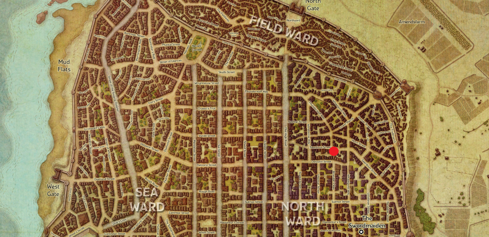
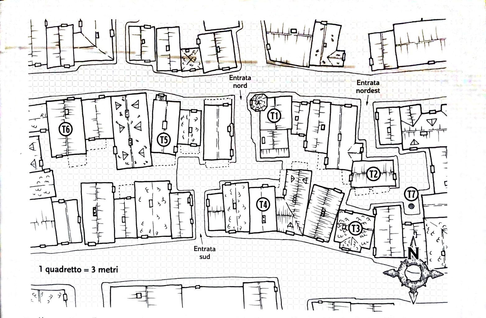
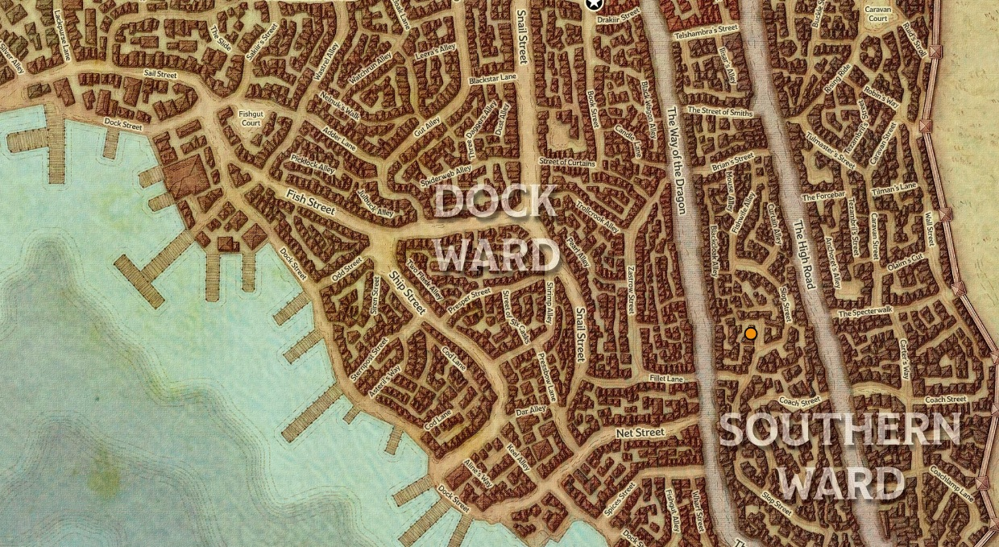

# - I  Sera
## Giorno 1: Inizio
Nella taverna dove stiamo riposando inizia una zuffa, le parti si dividono in un gruppo di cinque umani capitanati da un uomo con i capelli completamente rasati e un tatuaggio con degli occhi (Krenz) e una mezza-orchessa (Yagra); gli umani fanno parte della gilda di xanathar.  
Yagra (l’orchessa) stende il capitano (Krenz) e lo rende incosciente, ma viene subito circondata dai compagni del capitano.  
Dal pozzo al centro del locale escono fuori un troll e delle stirges (delle specie di sanguisughe).  
Una volta sconfitto il troll e i suoi parassiti Yagra e Krenz (trasportato di peso dal suo gruppo) escono correndo dalla locanda e uno dei clienti della locanda si avvicina a noi presentandosi come Volothamp Geddarm.  
Volo ci parla di un suo amico di cui non ha più notizie ed ha paura si sia perso o peggio, sia stato rapito; ovviamente offre un compenso per il ritrovamento.  
Dopo aver accettato rivela qualche dettaglio in più sul suo amico e sull’ultima volta che sono stati insieme.  
Il nome del giovane è Floon, un umano biondiccio sulla trentina, l’ultima serata insieme l’hanno passata due sere prima in una taverna chiamata “Skewered Dragon”.  

## Giorno 2: Trovare Floom per conto di Volo  
Dopo aver riposato per la notte partiamo per la ricerca della suddetta taverna, passano per le strade di Waterdeep notiamo del sangue sparso per la strada, circa mezza dozzina di corpi morti e delle guardie che tengono prigionieri tre uomini probabili artefici o ultimi sopravvissuti del massacro.  
Continuando per la strada ormai giunti a destinazione notiamo un negozietto e ci entriamo, all’interno troviamo un piccolo uomo, calvo e con degli occhi viola tatuati sul viso.  
L’uomo vende trinkets (oggetti particolari non molto utili), nel mentre delle transizioni chiediamo delle informazioni, prima sul suo tatuaggio (simile a quello del capitano Krentz), senza avere risposta e successivamente su Floon, l’uomo di cui siamo alla ricerca. Risponde di aver visto qualche sera prima una persona con le stesse caratteristiche fisiche venir rapita, e che uno dei rapitori avesse un tatuaggio.  
Usciti dal negozio ci dirigiamo alla taverna, o quel che ne rimane. La porta è chiusa, ma Marco riesce ad entrare dalla finestra mentre noi grazie ad Emanuele sfondiamo (non letteralmente perché ha usato un incantesimo); all’interno troviamo tre creature (kenku) che giravano al buio per la locanda.  
Una volta sconfitti scendiamo per le scale per il quale uno degli esserini stava tentando di fuggire, dove Giacomo trova una piccola stanza segreta contenente 4 dipinti, ne prende 2; Emanuele trova un uccello di carta (un foglio magico che viaggia verso il destinatario del messaggio).   
Scendiamo poi per delle scale che ci portano al sistema fognario della città; con delle torce percorriamo parte delle fogne fino ad arrivare ad una stanza circolare dove fluiscono diversi canali delle fogne, da lì risaliamo per delle scale e ci troviamo due piccoli goblin a guardia dei dormitori. Troviamo un uomo a guardia e ci dice che il ragazzo (Floon) era stato rapito da loro per conto del capo per fargli delle domande, ci indica sia la stanza del capo che quella in cui Floon è prigioniero.  
Andiamo da Floon e per sicurezza chiediamo prima se conosce un vecchio (Volo) descrivendone i tratti fisici e se la storia corrispondesse a quella descrittaci inizialmente da Volo; Lo liberiamo e lo portiamo con noi nella stanza del capo per vedere cosa volesse farne il capo di Floon.  
Entrati nella stanza del boss notiamo un mezzo orco di guardia e un mind flayer con in braccio un intellect devourer.  
Il mind flayer lascia il suo animaletto e si alza, dirigendosi verso una porta che porta ad un’altra stanza, da lì si tele trasporterà via dalla zona.  
Sconfiggiamo i due mostri rimasti nella stanza e prendiamo come bottino un grimorio con diversi incantesimi iscritti, due pozioni e delle monete.  

# - II  Sera
## Giorno 2: La Casa
Volo ci offre un edificio come ricompensa per aver ritrovato floom,
Ben Dover paga 2 platini per il documento di proprietà.  
**_La magione si trova all'angolo teschio di troll entrata nord (trollskull alley)_**  
  

La casa è cokpletamente in rovina e impolverata, apriamo le finestre del primo piano e notiamo resti di tavoli e sedie come quelle di una taverna.  
Saliamo al secondo piano e Maple percepisce una presenza (probabilmente spettrale) neutrale, una volta aperte anche le finestre del secondo piano notiamo una coperta alzarsi e delle mani *spettrali*.  
Lo spettro si manifesta, il suo nome è Lif o era Lif, precedentemente era il proprietario dell'edificio, ed anche oste della locanda che lo ospitava; Ci concede di rimanere nell'edificio e offre anche il suo aiuto, a patto però di rimettere a nuovo la locanda.
Maple sale per aprire le ultime finestre rimaste della locanda mentre il resto del gruppo scende al primo piano per parlare con volo che consegna l'atto di proprietà, inoltre ci parla dei punti di interesse del quartiere  

    
- T1: Magione(La struttura che ci ha dato Volo)
- T2: Negozio
- T3: Fabbro
- T4: Erborista
- T5: Agenzia investigativa
- T6: Biblioteca
- T7: Fogne

Maple e Seebo vanno dal fabbro per comprare un lucchetto per la porta e pagare per le riparazioni di casa.  
Uscendo dall'edificio Seebo riceve un messaggio dall'enclave dello smeraldo che si trova a Phaulnkonmere nel quartiere meridionale.

Incamminandoci per andare dall'erborista Maple e Seebo vengono fermati da una donna di nome Savra, ci parla di come lei e la sua gilda combattano i cattivi e ci invita ad andare alla sede che si trova nella zona del mercato.  
Nel frattempo Dixon riceve un messaggio da Davill Starson e gli chiede di trovarlo al portone spalancato  
Ormai il sole è calato e ne approfittiamo per andare a riposarci
## Giorno 3: Freeroaming, le gilde
Maple e Seebo si avviano al mercato per parlare con Savra mentre Ben e Dixon  si dirigono alla taverna dove ci siamo incontrati per parlare con l'oste

Maple e Seebo parlano con Savra ma entrambi rifiutano l'invito alla gilda (Savra sembra molto insistente sul bene superiore dell'organizzazione e molto vaga sulle effettive buone intenzioni dietro le loro azioni). Uscendo dalla struttura incontrano Ben che chiede loro delle informazioni su Savra e l'organizzazzione.  
Nel frattempo Dixon è rimasto alla locanda perché troppo ubriaco per andare in giro  
Mentre Ben entra nella sede della gilda di Savra, Maple e Seebo si dirigono verso l'enclave dello smeraldo.
  
Arrivati lì trovano un uomo che parla loro della bellezza, della crudeltà della natura e di come essa sia alla base della vita;  
parla poi di un contadino che ha bisogno di aiuto con degli spaventapasseri impossessati e chiede loro di dargli una mano, prima di andare però dona a Maple una piccola scatola con dei fori della grandezza di una piccola gemma.  
Maple e Seebo si dirigono quindi nelle campagne ad est di waterdeep per aiutare il contadino, con l'aiuto di Ben e Dixon (che passavano di lì per caso) risolvono il problema degli spaventapasseri e si separano nuovamente ritornando in città, Ben e Dixon verso la locanda dove siam partiti mentre Seebo e Maple verso Paulkonmere