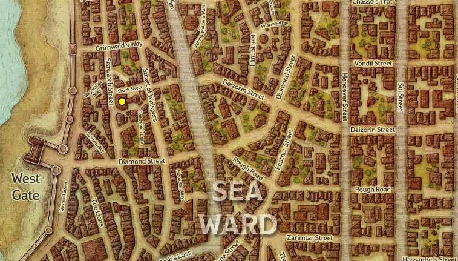
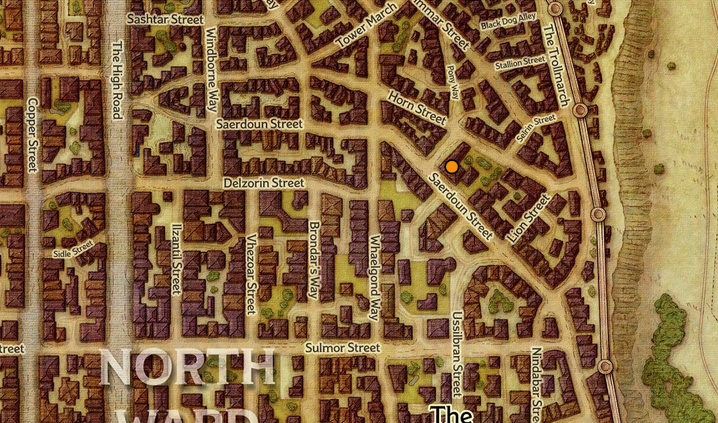

# - I  Sera
## Giorno 1: Inizio
Nella taverna dove stiamo riposando inizia una zuffa, le parti si dividono in un gruppo di cinque umani capitanati da un uomo con i capelli completamente rasati e un tatuaggio con degli occhi (Krenz) e una mezza-orchessa (Yagra); gli umani fanno parte della gilda di xanathar.  
Yagra (l’orchessa) stende il capitano (Krenz) e lo rende incosciente, ma viene subito circondata dai compagni del capitano.  
Dal pozzo al centro del locale escono fuori un troll e delle stirges (delle specie di sanguisughe).  
Una volta sconfitto il troll e i suoi parassiti Yagra e Krenz (trasportato di peso dal suo gruppo) escono correndo dalla locanda e uno dei clienti della locanda si avvicina a noi presentandosi come Volothamp Geddarm.  
Volo ci parla di un suo amico di cui non ha più notizie ed ha paura si sia perso o peggio, sia stato rapito; ovviamente offre un compenso per il ritrovamento.  
Dopo aver accettato rivela qualche dettaglio in più sul suo amico e sull’ultima volta che sono stati insieme.  
Il nome del giovane è Floon, un umano biondiccio sulla trentina, l’ultima serata insieme l’hanno passata due sere prima in una taverna chiamata “Skewered Dragon”.  

 

## Giorno 2: Trovare Floom per conto di Volo  
Dopo aver riposato per la notte partiamo per la ricerca della suddetta taverna, passano per le strade di Waterdeep notiamo del sangue sparso per la strada, circa mezza dozzina di corpi morti e delle guardie che tengono prigionieri tre uomini probabili artefici o ultimi sopravvissuti del massacro.  
Continuando per la strada ormai giunti a destinazione notiamo un negozietto e ci entriamo, all’interno troviamo un piccolo uomo, calvo e con degli occhi viola tatuati sul viso.  
L’uomo vende trinkets (oggetti particolari non molto utili), nel mentre delle transizioni chiediamo delle informazioni, prima sul suo tatuaggio (simile a quello del capitano Krentz), senza avere risposta e successivamente su Floon, l’uomo di cui siamo alla ricerca. Risponde di aver visto qualche sera prima una persona con le stesse caratteristiche fisiche venir rapita, e che uno dei rapitori avesse un tatuaggio.  
Usciti dal negozio ci dirigiamo alla taverna, o quel che ne rimane. La porta è chiusa, ma Dixon Butts riesce ad entrare dalla finestra mentre noi grazie ad Ben Dover sfondiamo (non letteralmente perché ha usato un incantesimo); all’interno troviamo tre creature (kenku) che giravano al buio per la locanda.  
Una volta sconfitti scendiamo per le scale per il quale uno degli esserini stava tentando di fuggire, dove Seebo trova una piccola stanza segreta contenente 4 dipinti, ne prende 2; Ben Dover trova un uccello di carta (un foglio magico che viaggia verso il destinatario del messaggio).   
Scendiamo poi per delle scale che ci portano al sistema fognario della città; con delle torce percorriamo parte delle fogne fino ad arrivare ad una stanza circolare dove fluiscono diversi canali delle fogne, da lì risaliamo per delle scale e ci troviamo due piccoli goblin a guardia dei dormitori. Troviamo un uomo a guardia e ci dice che il ragazzo (Floon) era stato rapito da loro per conto del capo per fargli delle domande, ci indica sia la stanza del capo che quella in cui Floon è prigioniero.  
Andiamo da Floon e per sicurezza chiediamo prima se conosce un vecchio (Volo) descrivendone i tratti fisici e se la storia corrispondesse a quella descrittaci inizialmente da Volo; Lo liberiamo e lo portiamo con noi nella stanza del capo per vedere cosa volesse farne il capo di Floon.  
Entrati nella stanza del boss notiamo un mezzo orco di guardia e un mind flayer con in braccio un intellect devourer.  
Il mind flayer lascia il suo animaletto e si alza, dirigendosi verso una porta che porta ad un’altra stanza, da lì si tele trasporterà via dalla zona.  
Sconfiggiamo i due mostri rimasti nella stanza e prendiamo come bottino un grimorio con diversi incantesimi iscritti, due pozioni e delle monete.  

# - II  Sera
## Giorno 2: La Casa
Volo ci offre un edificio come ricompensa per aver ritrovato floom,
Ben Dover paga 2 platini per il documento di proprietà.  
**_La magione si trova all'angolo teschio di troll entrata nord (trollskull alley)_**  
  

La casa è cokpletamente in rovina e impolverata, apriamo le finestre del primo piano e notiamo resti di tavoli e sedie come quelle di una taverna.  
Saliamo al secondo piano e Maple percepisce una presenza (probabilmente spettrale) neutrale, una volta aperte anche le finestre del secondo piano notiamo una coperta alzarsi e delle mani *spettrali*.  
Lo spettro si manifesta, il suo nome è Lif o era Lif, precedentemente era il proprietario dell'edificio, ed anche oste della locanda che lo ospitava; Ci concede di rimanere nell'edificio e offre anche il suo aiuto, a patto però di rimettere a nuovo la locanda.
Maple sale per aprire le ultime finestre rimaste della locanda mentre il resto del gruppo scende al primo piano per parlare con volo che consegna l'atto di proprietà, inoltre ci parla dei punti di interesse del quartiere  

    
- T1: Magione(La struttura che ci ha dato Volo)
- T2: Negozio
- T3: Fabbro
- T4: Erborista
- T5: Agenzia investigativa
- T6: Biblioteca
- T7: Fogne

Maple e Seebo vanno dal fabbro per comprare un lucchetto per la porta e pagare per le riparazioni di casa.  
Uscendo dall'edificio Seebo riceve un messaggio dall'enclave dello smeraldo che si trova a Phaulnkonmere nel quartiere meridionale.

Incamminandoci per andare dall'erborista Maple e Seebo vengono fermati da una donna di nome Savra, ci parla di come lei e la sua gilda combattano i cattivi e ci invita ad andare alla sede che si trova nella zona del mercato.  
Nel frattempo Dixon riceve un messaggio da Davil Starsong e gli chiede di trovarlo al portone spalancato  
Ormai il sole è calato e ne approfittiamo per andare a riposarci

## Giorno 3: Freeroaming, le gilde

Maple e Seebo si avviano al mercato per parlare con Savra mentre Ben e Dixon  si dirigono alla taverna dove ci siamo incontrati per parlare con l'oste

Maple e Seebo parlano con Savra ma entrambi rifiutano l'invito alla gilda (Savra sembra molto insistente sul bene superiore dell'organizzazione e molto vaga sulle effettive buone intenzioni dietro le loro azioni). Uscendo dalla struttura incontrano Ben che chiede loro delle informazioni su Savra e l'organizzazzione.  
Nel frattempo Dixon è rimasto alla locanda perché troppo ubriaco per andare in giro  
Mentre Ben entra nella sede della gilda di Savra, Maple e Seebo si dirigono verso l'enclave dello smeraldo.

  

Arrivati lì trovano un uomo che parla loro della bellezza, della crudeltà della natura e di come essa sia alla base della vita;  
parla poi di un contadino che ha bisogno di aiuto con degli spaventapasseri impossessati e chiede loro di dargli una mano, prima di andare però dona a Maple una piccola scatola con dei fori della grandezza di una piccola gemma.  
Maple e Seebo si dirigono quindi nelle campagne ad est di waterdeep per aiutare il contadino, con l'aiuto di Ben e Dixon (che passavano di lì per caso) risolvono il problema degli spaventapasseri e si separano nuovamente ritornando in città, Ben e Dixon verso la locanda dove siam partiti mentre Seebo e Maple verso Paulkonmere

Alla locanda Starsong dice loro di andare verso un vicolo. Lì troveranno dei cadaveri da poco assassinati (pugnalati in petto), i colpevoli sono probabilmente due persone che stanno tentando di scappare, una ci riesce mentre l'altra combatte contro Dixon Butts ed Ben Dover.
Riescono ad uccidere l'uomo con l'aiuto di una guardia e poi ritornano in taverna da Starson.

# - III  Sera  

Alla taverna gli viene consegnata una borsa di pozioni da consegnare ad una donna che si trova al "Cacciatore degli dei" che si trova nella zona marittima della città; li aspetterà lì la sera.

  

Ormai entrati a far parte dell'organizzazione della rete nera entrambi si tatuano il simbolo in segno di appartenenza.

Maple e Seebo nel frattempo rientrano in città nonostante una guardia avesse provato ad impedirglielo, si dirigono alla sede dell'enclave dello smeraldo ma non c'è nessuno ad aspettarli, per questo si dirigeranno verso casa per poter passare la notte.

## Giorno 4: Freeroaming, le gilde II

Nella notte Dixon Butts sente rumori vicino casa nostra, probabilmente qualche spia.

È mattina e Maple e Seebo tornano alla sede dell'enclave, il titolare (Melannor) si congratula con loro e li porta dentro casa per bere del tè, gli parla di un necromante che sta creando problemi in città, in particolare di notte sembrano esser stati avvistati degli scheletri girare per le strade. Di questo se ne sta occupando un generale dell'esercito a cui Melnar chiede di dare una mano.

Non avendo nulla da fare durante la giornata Maple e Seebo ritornano a casa ed aspettano la notte insieme a Dixon Butts ed Ben Dover.

Arrivata una certa ora Dixon Butts ed Ben Dover si incamminano per andare al loro incontro al Cacciatore degli dei. Ormai vicini sentono qualcuno camminare con dei tacchi ma non ne comprendono benissimo la direzione; in lontananza vendono una carrozza esattamente di fronte il luogo di incontro e si dirigono verso di essa.

All'interno della carrozza trovano la donna a cui dovevano consegnare le pozioni, e ricevono in cambio un sacchetto da consegnare a Davil Starsong.

Ritornando verso la locanda del Portale spalancato notano che anche delle guardie camminano nella loro stessa direzione, Ben Dover invia l'uccello di carta per avvisare Davil del loro arrivo.

Nel frattempo alla porta di casa arriva il generale Ambrose, l'uomo che Maple e Seebo dovranno aiutare. Con un po' di scetticismo il generale accetta il loro aiuto e chiede di dividersi per velocizzare il processo di localizzazione del nascondiglio del necromante. Si ritrovano dopo qualche ora di fronte alla casa e condividono le informazioni ricavate, son stati visti degli scheletri uscire da una botola di una casa abbandonata; si dirigono lì ed entrano nella botola dopo aver distrutto un paio di scheletri.

Dixon Butts ed Ben Dover intanto raggiungono le guardie di fronte alla locanda, e travestiti provano a prendere informazioni sul perché della venuta delle guardie alla locanda, non raccogliendo nessuna informazione utile entrano in taverna, vedono Davil Starsong scendere dalle scale scortato da delle guardie.
Uscite tutte le guardie salgono al secondo piano della locanda ("sede" della rete nera) e trovano una donna ad aspettarli, Tashlyn Yafeera, a cui consegnano il sacchetto ricevuto.
Tashlyn dice anche che chiunque nella gilda è rimpiazzabile, tranne il capo della gilda di cui si sà solamente che appartiene alla razza dei (Beholders), chiede loro anche di tornare la sera successiva per offrire qualche compito.

Seebo, Maple ed il generale attraversano il lungo percorso sotterraneo trovato entrando nella botola della casa abbandonata, e alla fine si ritrovano in un cimitero, nello specifico in un grande mausoleo dove trovano degli scheletri ad aspettarli insieme al necromante.
Dopo aver sconfitto il necromante il generale si separa e Maple e Seebo ritornano a casa.

# - IV Sera
## Giorno 5 Palla di fuoco al vicolo Teschio di troll

Si ritrovano tutti in casa e passano la notte, la mattina successiva vengono svegliati da un'esplosione.

Uscendo di casa notano che il negozio (T2) è andato completamente distrutto, secondo dei testimoni il bersaglio dell'attacco sarebbe stato uno gnomo che portava qualcosa di importante; un ragazzo ha trovato una collana con 3 perle e una di queste è nera, sicuramente è con questa collana che è stata lanciata la palla di fuoco. Inoltre un testimone afferma di aver notato che il colpevole fosse fatto di metallo.

Dixon Butts si dirige verso la locanda del portale spalancato per parlare con Tashlyn, lei confida che lo gnomo ed altri 2 uomini erano diretti alla casa per consegnare delle pietre utitli a Dixon Butts ed Ben Dover, dei 3, 2 sono morti, mentre il terzo è disperso e non si sanno più notizie. Il suo nome è Urstul Floxtin.

Considerando l'origine metallica del colpevole consiglia di andare alla fabbrica di automi anche chiamata casa delle mani ispirate.

  

Consiglia inoltre di far attenzione alle guardie e a persone collegate ala famiglia Gralhund che controlla gran parte delle forze dell'ordine della città, ultimamente non scorre buon sangue tra loro e la rete nera.

Tutti e 4 si avviano verso l'officina degli automi, sul tetto notiamo un automa che gli lancia 2 uccelli meccanici e poi scompare.

Distrutti gli uccelli entriamo nell'edificio, dove un vecchio li accoglie e li porta verso la donan che controlla la struttura, Valetta, di origini dragoniche e più alta di noi. Ci parla di un automa con "vita" propria che è stato rinchiuso in una stanza dell'edificio, ma non essendo mai uscito di lì non potrebbe per forza essere il colpevole. 

Valetta ci porta dall'automa, che confessa di aver creato altri automi come lui e che uno di questi è scappato.  
Dixon Butts ruba un oggetto dorato trovato per terra nella stanza dell automa, nel farlo però fa rumore, Maple se ne accorge e chiede a cosa possa servire quell'oggetto; Valetta pensa sia stato rubato qualcosa di importante e per questo fulmina Dixon Butts che appena si riprende la attacca e la uccide.  

  

Con un'attenta analisi capiscono che l'oggetto è un rilevatore di automi e che potrebbe aiutarli nel cercare l'automa colpevole della palla di fuoco.

Il rilevatore emette un segnale davvero debole, facendo qualche passo in tutte le direzioni ri riesce ad avere un'idea di dove dirigersi, la villa dei Gralhund

  

Tutti e 4 riescono a scavalcare il muro che circonda la proprietà, si avvicinano ad una delle finestre e notano 2 cadaveri, sentono però dei rumori vicino la porta d'ingresso principale.  
Fanno il giro della proprietà per provare ad entrare da una porta secondaria, l'unica senza serrature o lucchetti è quella della cucina. Dalla cucina trovano altri cadaveri nella dispensa e salgono per le stanze della servitù dove ancora più cadaveri rimangono stesi per terra.

La cucina è inoltre collegata alla sala da pranzo, lì vedono 2 uomini armati di clave che saccheggiano le tasche di altri cadaveri di fronte (dall'interno) della porta d'ingresso. Gli uomini hanno sulle braccia il tatuaggio della rete nera

Ben Dover decide di rifare tutto il giro della proprietà e di entrare dalla porta principale e di parlare con i 2 uomini visto che fan parte della sua stessa organizzazione; gli altri rimangono nascosti nel caso in cui la situazione sfuggisse di mano.

Ben Dover riesce a guadagnare un briciolo di fiducia dei due tipi della rete nera, che decidono di salire al piano superiore per aiutare il proprio capo

# - V Sera
## Villa Gralhund

I quattro si ritrovano tutti nel salone d'ingresso e decidono di finire di esplorare il piano terra visto che nessuna guardia/persona ostile sembra essere presente.  

In una stanza trovano un falco appartenente al capo famiglia, Seebo lo addomestica e lo porta con se.  

Vicino la porta d'ingresso trovano la porta per la libreria, dove trovano 3 fantasmi che sembrano fissati su di un libro, Maple prende il libro e lo apre ma viene attaccata dai fantasmi. Annientati i fantasmi l'unica strada rimanente è quella che porta al piano superiore.

Il gruppo sale quindi le scale per il piano superiore; trovano i due della rete nera combattere con delle guardie dei gralhund. Ben riesce ad intimidirli e ricevere delle informazioni sugli avvenimenti della tenuta.

Sia le guardie che i seguaci della rete decidono di non collaborare con il gruppo e per questo vengono eliminati.

Proseguendo per il corridoio spostano dei mobili e trovano un nano sporco di sangue prendere a calci una porta senza riuscire ad aprirla o ricevere risposta; il nano è Urstul e appena Ben e Dixon si presentano come seguaci della rete nera trema dal terrore.
Urstul cerca di riprendere la gemma (che sarebbe dovuta arrivare in mano di Dixon e Ben) data al capo famiglia dei gralhund

Seebo e Maple tornano indietro per controllare una stanza in cui non erano ancora entrati, lì trovano una donna armata di pugnale e una guardia a difenderla, sono la moglie del capo famiglia e il capo delle guardie del corpo.
Si sono nascosti nella stanza per evitare di venir uccisi da Urstul che in preda all'ira ha decimato le guardie personali dei gralhund.

Seebo e Maple li aiutano a fuggire dalla magione in sicurezza, nel mentre dixon e ben attaccano Urstul perché non voleva fornire informazioni utili per inquadrare meglio la situazione.
Urstul voleva riprendere la gemma per paura delle conseguenze (probabilmente paura della rete nera)

Sconfitto Urstul con l'aiuto di Maple scoprono un compartimento segreto in una cassa appartenente alla signora della casa e all'interno trovano delle vesti che ricordano vesti di un qualche culto.

Tutti e quattro ritornano alla porta che Urstul prendeva a calci e alla porta adesso si sente una voce che chiede di Hrabbaz, Maple e Seebo intuiscono sia la guardia del corpo della signora gralhund, prima di riuscire a parlare con l'uomo alla porta Dixon sfonda la porta e catapulta per terra l'uomo che si trovava dietro.

L'uomo era Orond Gralhund e spaventato si chiede chi siano i quattro di fronte a lui.

Dixon tenta di intimidirlo e convincerlo a lasciare a loro la gemma rubata da Urstul, ma Orond non intende lasciarla, anzi chiede 500 platini per averla.

Dixon lo uccide e ruba la gemma, da lì capiscono che non si tratta solamente di una gemma, ma di una gemma dove all'interno sembra essere contenuto un antico drago rimpicciolito.

Ormai stremati rimangono a dormire nella magione ormai senza altra anima viva.

## Giorno 6 La ricerca della donna a capo della casa Gralhund

Svegli e pieni di energie Escono dalla tenuta e decidono di cercare la donna salvata da Seebo e Maple, Seebo si trasforma in lupo per tentare di fiutare l'odore della donna nella città, si dirigono prima alla Locanda del portale spalancato ma lì non trovano nessun indizio. Provano ad andare verso il porto, ma trovano solamente dei vestiti simili a quelli trovati nel doppio fondo della cassa.

Sconsolati ritornano a casa e trovano Lif contento di annunciare i primi clienti della locanda dopo anni di inattività.

I clienti eran proprio La donna con la sua guardia del corpo, si presentano e chiedono cosa sia successo nella magione dopo la loro fuga.

La donna Si chiama Yalah e come intuito prima la guardia del corpo Hrabbaz.

Maple spiega che Orond marito di Yalah era ormai morto e con lui anche Urstul.

Alla notizia della morte del marito non sembrava esser molto dispiaciuta, di fatti chiese subito se per caso il gruppo fosse entrato in contatto con un oggetto particolare che suo marito stava custodendo, l'oggetto in questione è un artefatto che si dica possa aprire le porte del nascondiglio del drago che riposa nel sottosuolo di Waterdeep.

Yalah mostra di avere un bastone simile a quello trovato dal gruppo per controllare gli automi, e rivela che l'automa che i quattro stavano cercando è programmato per cercare quella gemma e che si sta dirigendo proprio verso la casa.

Nel frattempo si sentono delle guardie circondare la casa, probabilmente per conto di Yalah ormai in comando delle forze dell'ordine della città.

I quattro escono dalla stanza della donna e scendono di sotto per parlare di cosa fare con la gemma.